# Data Discovery and Exploration

## Table of Contents

- [Introduction](#introduction)
- [Prerequisites](#prerequisites)
- [Lab Overview](#lab-overview)
- [Step 1: Exploring the Infrastructure & Data Manager](#step-1-exploring-the-infrastructure--data-manager)
- [Step 2: Understanding the Star Schema](#step-2-understanding-the-star-schema)
- [Step 3: Previewing Data](#step-3-previewing-data)
- [Step 4: Using the Query Workspace](#step-4-using-the-query-workspace)
- [Step 5: Business Questions with SQL](#step-5-business-questions-with-sql)
- [Step 6: Reviewing Query History](#step-6-reviewing-query-history)
- [Key Takeaways](#key-takeaways)
- [Best Practices](#best-practices)
- [Related Labs](#related-labs)

## Introduction

### What This Lab Demonstrates

This lab demonstrates how business users can explore and analyze data in watsonx.data without writing code. You'll learn to navigate the Data Manager interface, understand data relationships, preview tables, and run pre-built SQL queries to answer business questions — all through an intuitive graphical interface.

**Business Scenario:**

You are a business analyst at **FinWin Bank**, a wealth management firm with over 50 years in banking, brokerage, and wealth management. Your financial advisors currently waste hours navigating multiple disconnected systems:

- A legacy Netezza data warehouse for historical trades
- A PostgreSQL database for customer records
- A modern Iceberg lakehouse where data has been consolidated for analytics

Your job today: **Explore the unified data platform (watsonx.data) to understand what data is available, how it connects, and what insights you can extract** — all without technical coding skills.

### What You'll Learn

- **Navigate watsonx.data**: Use the Data Manager interface to browse catalogs and schemas
- **Understand data catalogs**: Learn the purpose of different data sources (Postgres, Netezza, Iceberg, Hive)
- **Explore table structures**: Browse tables, view columns, and understand data types
- **Preview data**: See sample data from any table
- **Use Query Workspace**: Generate and run queries with auto-complete
- **Understand relationships**: Learn how tables connect in a star schema
- **Run business queries**: Execute pre-built SQL queries that join data across sources
- **Review query history**: Track and analyze past queries

### What You'll Build

By the end of this lab, you'll have:

- ✅ Explored FinWin Bank's data landscape across four catalogs
- ✅ Understood the star schema structure for equity transactions
- ✅ Previewed data from multiple tables
- ✅ Run queries that join data across Postgres, Netezza, and Iceberg
- ✅ Answered business questions about customer trading patterns
- ✅ Gained confidence using watsonx.data as a business user

### Why This Matters

**Business Value:**

- **Unified Access**: Query data from multiple sources in one place
- **Self-Service Analytics**: Business users can explore data without IT support
- **Faster Insights**: No need to wait for data exports or reports
- **Data Federation**: Combine operational, historical, and analytical data seamlessly
- **Transparency**: See exactly what data is available and how it's structured

**Target Audience:**

- Business Analysts
- Data Consumers
- Business Intelligence Users
- Marketing Analysts
- Finance Analysts
- Anyone who needs to understand and explore data without technical coding skills

## Prerequisites

### Required Access

- ✅ Complete [Getting Started Setup Guide](../Getting_Started/README.md) Section 1
- ✅ Access to the shared **watsonx.data** environment
- ✅ Basic understanding of business data concepts

### Skills Needed

- Basic familiarity with tables and columns
- Understanding of business metrics (customers, transactions, accounts)
- No SQL or programming experience required (queries are provided)

### Time Required

Approximately 30-45 minutes

## Lab Overview

### The Data Landscape

FinWin Bank's data lives across four catalogs in watsonx.data. Each serves a different purpose:

| Catalog              | What it is                      | What's in it                                                                      |
| -------------------- | ------------------------------- | --------------------------------------------------------------------------------- |
| **postgres_catalog** | Operational database            | Live customer records (`customers_table`)                                         |
| **nz_catalog**       | Legacy data warehouse (Netezza) | Current-year equity transactions (2025)                                           |
| **iceberg_data**     | Modern lakehouse                | Historical transactions (2019–2024), accounts, holdings — offloaded and optimized |
| **hive_catalog**     | Raw data lake                   | Source files (accounts, holdings, tax rates) before processing                    |

**The power of watsonx.data** is that you can query across all of these from a single interface — a financial advisor can look up a customer in Postgres, check their trading history in Iceberg, and see current-year activity in Netezza, all in one place.

### Data Architecture

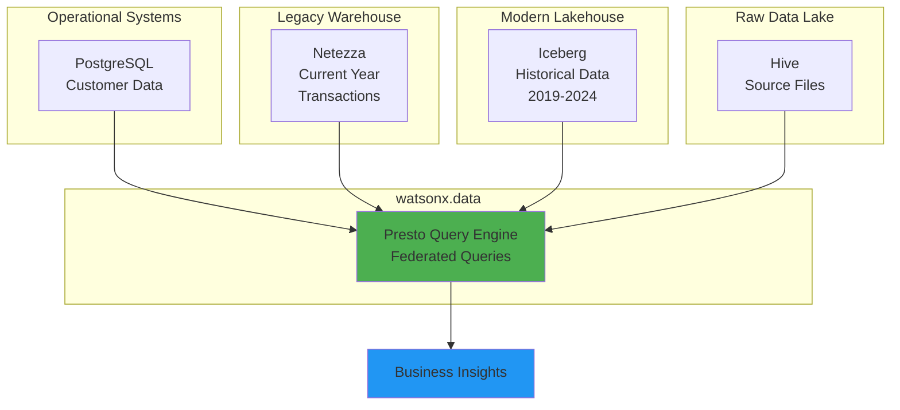

### Star Schema Overview

Your Iceberg schema contains a **star schema** — a common pattern for analytics where a central **fact table** records business events, surrounded by **dimension tables** that provide context.

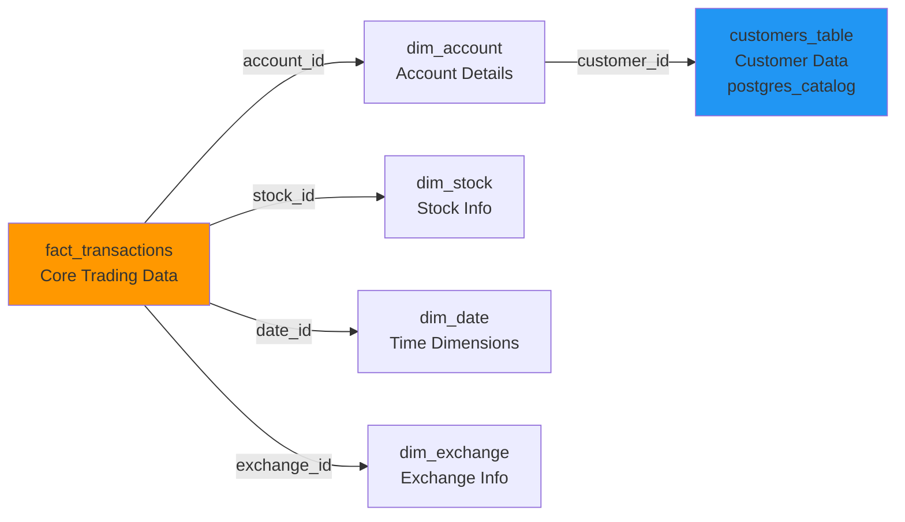

### Lab Workflow

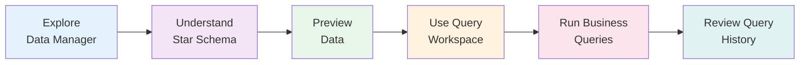

## Step 1: Exploring the Infrastructure & Data Manager

### 1.1 Access watsonx.data

1. From the [IBM Cloud Resource List](https://cloud.ibm.com/resources), open your **watsonx.data** instance (under Databases, labeled `wxdata-`)

2. Click the **hamburger menu** (☰) → **Infrastructure manager**

   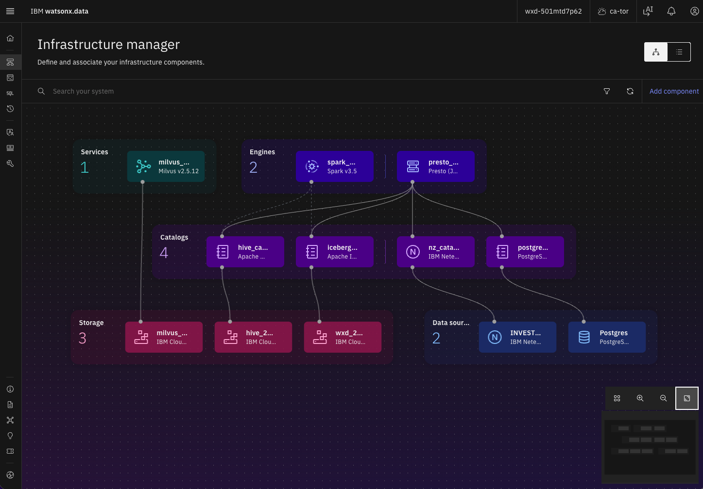

### 1.2 Browse Data sources

3. You'll observe all the Services, Engines, Catalogs, Storage and Data Sources. Click **Postgres** Data Source to see Database details

   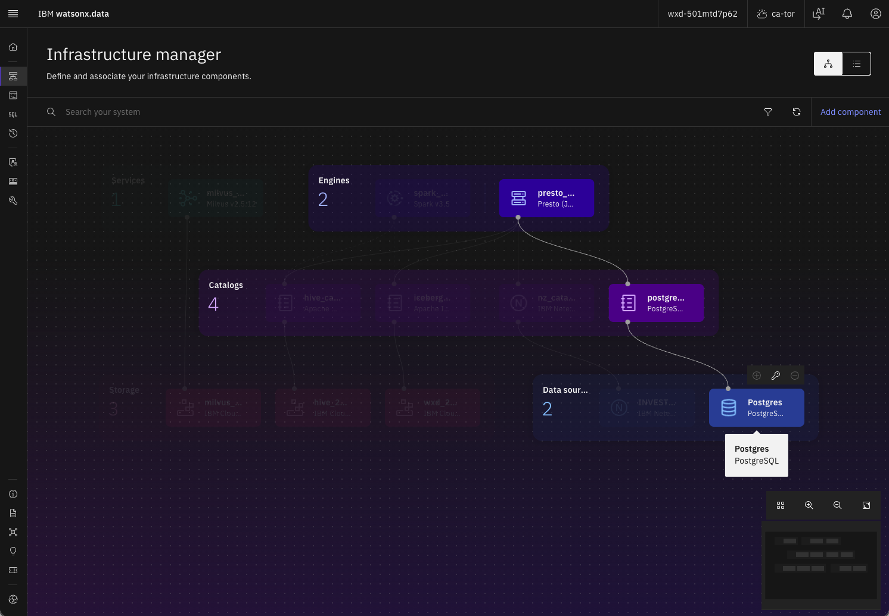

### 1.3 Browse Catalogs

4. Click the **hamburger menu** (☰) → **Data manager**

   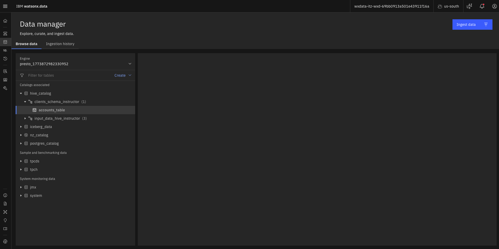

5. You'll see the four catalogs listed. Click **iceberg_data** to expand it and find your schema (e.g., `netezza_offload_<initials>`)

   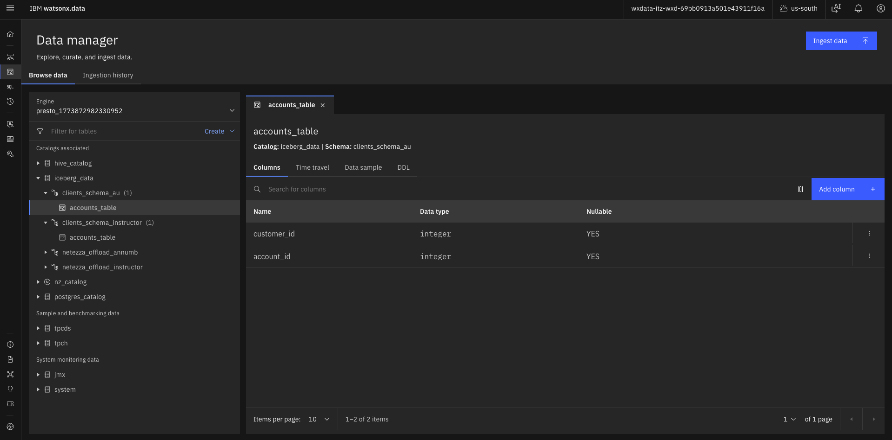

### 1.4 Explore Your Schema

6. Click on your schema to see the tables inside:
   - `fact_transactions` - The core trading data
   - `dim_account` - Account information
   - `dim_stock` - Stock details
   - `dim_exchange` - Exchange information
   - `dim_date` - Date dimensions

7. Click on any table name to see its structure:
   - Column names
   - Data types
   - Descriptions (if available)

## Step 2: Understanding the Star Schema

Your Iceberg schema contains a **star schema** — a common pattern for analytics where a central **fact table** records business events, surrounded by **dimension tables** that provide context.

Navigate to your schema under **iceberg_data** and explore these tables:

### Fact Table: `fact_transactions`

The core of the dataset — every stock trade made by FinWin Bank clients.

| Column         | What it means                    |
| -------------- | -------------------------------- |
| transaction_id | Unique trade ID                  |
| account_id     | Who traded (→ dim_account)       |
| stock_id       | What was traded (→ dim_stock)    |
| exchange_id    | Where it traded (→ dim_exchange) |
| date_id        | When it happened (→ dim_date)    |
| order_type     | BUY or SELL                      |
| quantity       | Number of shares                 |
| price          | Price per share                  |
| total_value    | quantity × price                 |

### Dimension Tables

Click on each table to see its columns. Use the **Preview** button to see sample data.

**dim_account** — Account Details

- Account type (Retail/Institutional/Margin)
- Status (Active/Inactive)
- Risk level (Low/Medium/High)
- Balance
- Trading experience

**dim_stock** — Stock Information

- 100 stocks with ticker symbol
- Company name
- Sector (Technology, Finance, Healthcare, etc.)
- Industry
- Market cap

**dim_exchange** — Exchange Details

- Exchange name (NYSE, NASDAQ, SGX, etc.)
- Country
- Timezone
- Currency

**dim_date** — Time Dimensions

- Date breakdowns: year, quarter, month, week
- Day of week
- Weekend flag
- Holiday indicators

### Customer Data (Different Catalog)

Navigate to **postgres_catalog** → **bankdemo** → **customers_table** to see live customer records:

- Names
- Contact info
- Location
- Date of birth
- Account opening date

  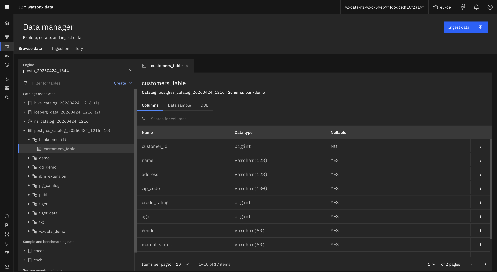

> **Note:** This table lives in Postgres (the operational database) but watsonx.data lets you query it alongside Iceberg and Netezza data — that's federation in action.

## Step 3: Previewing Data

For any table in Data Manager:

1. Click the table name to see its columns and types

2. Click **Preview** or **Sample Data** to see actual rows

   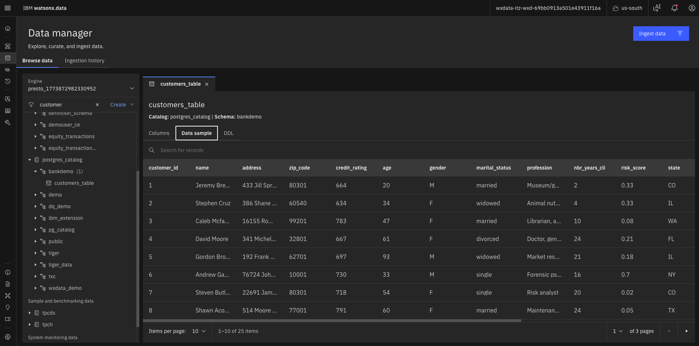

### Try These Previews

**Preview dim_stock:**

- You'll see familiar names like IBM, AMZN, BAC, and HD alongside synthetic companies
- Notice how each stock has a sector and market cap
- This lets you analyze trading patterns by industry

**Preview dim_account:**

- See different account types (Retail, Institutional, Margin)
- Notice risk levels and trading experience
- Observe account balances and status

**Preview customers_table:**

- See customer names and locations
- Notice the customer_id that links to accounts
- Observe demographic information

## Step 4: Using the Query Workspace

### 4.1 Access Query Workspace

1. From the hamburger menu (☰), select **Query workspace**

2. In the left panel, navigate to any table (e.g., `dim_stock`)

### 4.2 Generate a Query

3. Click the **three dots** (⋮) next to the table → **Generate SELECT**

4. A query appears in the editor. Click **Run on presto_engine** to execute it.

   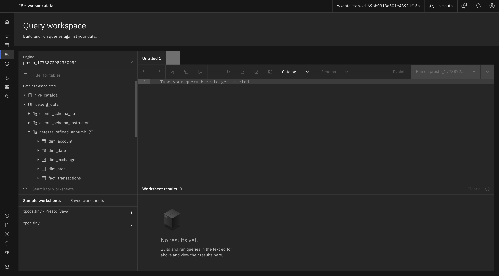

### 4.3 View Results

5. Results appear below with:
   - Column headers
   - Data rows
   - Row count
   - Execution time

   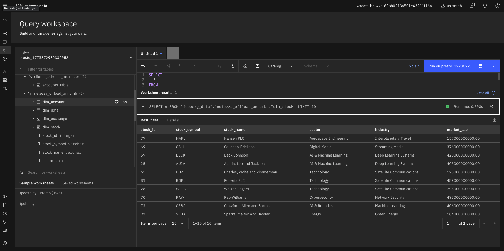

### Tips for Query Workspace

- **Auto-complete**: Start typing table or column names and press Tab
- **Multiple queries**: Separate queries with semicolons
- **Save queries**: Use the Save button to keep frequently used queries
- **Export results**: Download results as CSV for further analysis

## Step 5: Business Questions with SQL

Now for the interesting part. Below are five business questions a FinWin Bank analyst might ask, each answered by a SQL query that **joins across multiple tables**. Copy each query into the Query Workspace and run it.

> **Note:** The queries below use the actual catalog names for this environment. If your environment has different catalog names, run `SHOW CATALOGS;` in the Query Workspace to find them, or check `ICEBERG_CATALOG`, `POSTGRES_CATALOG`, and `NETEZZA_CATALOG` in your `env.txt` file.
>
> **Engine:** Select **presto_engine** when running queries.

### 5.1 Customer Activity — Which customers traded the most last year?

Joins transactions → accounts → customers (across Iceberg and Postgres) to find the most active traders.

```sql
SELECT
    c.name,
    c.city,
    c.state,
    da.account_type,
    COUNT(ft.transaction_id) AS total_trades,
    SUM(ft.total_value) AS total_value
FROM iceberg_data_20260922_1602.netezza_offload_instructor.fact_transactions ft
JOIN iceberg_data_20260922_1602.netezza_offload_instructor.dim_account da
    ON ft.account_id = da.account_id
JOIN postgres_catalog_20260922_1602.bankdemo.customers_table c
    ON da.account_id = c.customer_id
JOIN iceberg_data_20260922_1602.netezza_offload_instructor.dim_date dd
    ON ft.date_id = dd.date_id
WHERE dd.year = 2024
GROUP BY c.name, c.city, c.state, da.account_type
ORDER BY total_value DESC
LIMIT 10;
```

**What This Shows:**

- Top 10 customers by trading value in 2024
- Customer names and locations
- Account types
- Total number of trades
- Total trading value

### 5.2 Stock Performance — What is the average trade price by sector?

Joins transactions → stocks to compare average prices across industry sectors.

```sql
SELECT
    ds.sector,
    COUNT(ft.transaction_id) AS trade_count,
    ROUND(AVG(ft.price), 2) AS avg_price,
    ROUND(SUM(ft.total_value), 2) AS total_volume
FROM iceberg_data_20260922_1602.netezza_offload_instructor.fact_transactions ft
JOIN iceberg_data_20260922_1602.netezza_offload_instructor.dim_stock ds
    ON ft.stock_id = ds.stock_id
GROUP BY ds.sector
ORDER BY total_volume DESC;
```

**What This Shows:**

- Trading activity by sector (Technology, Finance, Healthcare, etc.)
- Number of trades per sector
- Average stock price per sector
- Total trading volume per sector

### 5.3 Exchange Analysis — How does trading volume differ by exchange and year?

Joins transactions → exchanges → dates to show how activity is distributed across global exchanges over time.

```sql
SELECT
    de.exchange_name,
    de.country,
    dd.year,
    COUNT(ft.transaction_id) AS trade_count,
    ROUND(SUM(ft.total_value), 2) AS total_volume
FROM iceberg_data_20260922_1602.netezza_offload_instructor.fact_transactions ft
JOIN iceberg_data_20260922_1602.netezza_offload_instructor.dim_exchange de
    ON ft.exchange_id = de.exchange_id
JOIN iceberg_data_20260922_1602.netezza_offload_instructor.dim_date dd
    ON ft.date_id = dd.date_id
GROUP BY de.exchange_name, de.country, dd.year
ORDER BY dd.year, total_volume DESC;
```

**What This Shows:**

- Trading volume by exchange (NYSE, NASDAQ, etc.)
- Geographic distribution of trades
- Year-over-year trends
- Which exchanges are most active

### 5.4 Risk Profile — What do trading patterns look like by account risk level?

Joins transactions → accounts → dates to compare how low, medium, and high-risk accounts trade differently.

```sql
SELECT
    da.risk_level,
    da.account_type,
    dd.year,
    COUNT(ft.transaction_id) AS trade_count,
    ROUND(AVG(ft.quantity), 0) AS avg_shares_per_trade,
    ROUND(AVG(ft.total_value), 2) AS avg_trade_value
FROM iceberg_data_20260922_1602.netezza_offload_instructor.fact_transactions ft
JOIN iceberg_data_20260922_1602.netezza_offload_instructor.dim_account da
    ON ft.account_id = da.account_id
JOIN iceberg_data_20260922_1602.netezza_offload_instructor.dim_date dd
    ON ft.date_id = dd.date_id
GROUP BY da.risk_level, da.account_type, dd.year
ORDER BY dd.year, da.risk_level;
```

**What This Shows:**

- Trading behavior by risk level (Low, Medium, High)
- Differences between account types
- Average shares per trade
- Average trade value
- Trends over time

### 5.5 Cross-Source Federation — Combine current and historical data

This query spans **both Iceberg and Netezza** to find the top 10 accounts by total trading value across all years, demonstrating watsonx.data's federation capability.

```sql
SELECT
    da.account_id,
    da.account_type,
    da.risk_level,
    dd.year,
    SUM(ft.total_value) AS total_value
FROM (
    SELECT account_id, date_id, total_value
    FROM iceberg_data_20260922_1602.netezza_offload_instructor.fact_transactions
    UNION ALL
    SELECT account_id, date_id, total_value
    FROM nz_catalog_20260922_1602.equity_transactions_ly.fact_transactions
) ft
JOIN (
    SELECT account_id, account_type, risk_level
    FROM iceberg_data_20260922_1602.netezza_offload_instructor.dim_account
    UNION ALL
    SELECT account_id, account_type, risk_level
    FROM nz_catalog_20260922_1602.equity_transactions_ly.dim_account
) da ON ft.account_id = da.account_id
JOIN (
    SELECT date_id, year
    FROM iceberg_data_20260922_1602.netezza_offload_instructor.dim_date
    UNION ALL
    SELECT date_id, year
    FROM nz_catalog_20260922_1602.equity_transactions_ly.dim_date
) dd ON ft.date_id = dd.date_id
GROUP BY da.account_id, da.account_type, da.risk_level, dd.year
ORDER BY total_value DESC
LIMIT 10;
```

**What This Shows:**

- Top accounts across ALL years (2019-2025)
- Combines historical data (Iceberg) with current year (Netezza)
- Demonstrates data federation across catalogs
- Shows the power of unified querying

## Step 6: Reviewing Query History

After running queries, you can review past executions:

### 6.1 Access Query History

1. Hamburger menu (☰) → **Query history**

2. Each entry shows:
   - Query text
   - Who ran it
   - Status (Success/Failed)
   - Duration
   - Timestamp

   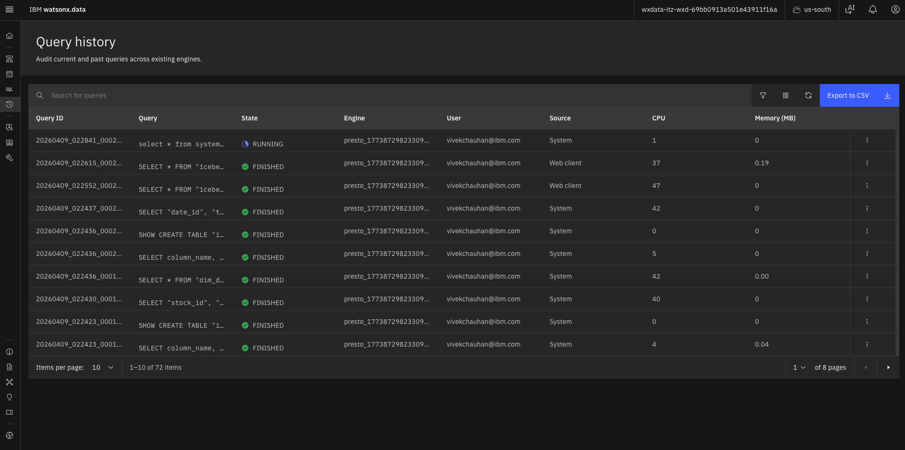

### 6.2 Analyze Execution Plans

3. Click any query to see its execution plan — useful for understanding:
   - Which data sources were accessed
   - How tables were joined
   - Query performance metrics
   - Resource usage

### Why Query History Matters

- **Audit trail**: Track who queried what data and when
- **Performance analysis**: Identify slow queries
- **Reuse queries**: Find and rerun previous queries
- **Troubleshooting**: Debug failed queries
- **Learning**: See how others structure their queries

## Key Takeaways

You've explored FinWin Bank's data landscape across four catalogs and seen how watsonx.data unifies them into a single queryable platform:

### ✅ Data Federation

- **Postgres** holds live customer data
- **Netezza** holds current-year transactions
- **Iceberg** holds optimized historical data
- **Presto** federates queries across all of them

### ✅ Star Schema Understanding

The star schema (fact + dimension tables) lets you slice trading data by:

- Customer demographics
- Stock characteristics
- Exchange locations
- Time periods

This structure enables answering complex business questions with simple joins.

### ✅ Key Skills Learned

- ✅ Navigate watsonx.data Data Manager
- ✅ Browse catalogs, schemas, and tables
- ✅ Preview data and understand table structures
- ✅ Use Query Workspace to run queries
- ✅ Join data across multiple sources
- ✅ Review query history and execution plans

### ✅ Business Value Realized

- **Self-Service**: Business users can explore data independently
- **Unified View**: Access all data sources from one interface
- **Fast Insights**: No waiting for IT or data exports
- **Transparency**: See exactly what data is available
- **Federation**: Combine operational, historical, and analytical data seamlessly

## Best Practices

### Exploring Data Effectively

✅ **DO:**

- **Start broad, then narrow**: Browse catalogs → schemas → tables
- **Preview before querying**: Use Preview to understand data structure
- **Check data types**: Understand column types before joining
- **Use auto-complete**: Let Query Workspace suggest table and column names
- **Save useful queries**: Keep frequently used queries for reuse

❌ **DON'T:**

- Query large tables without LIMIT clauses
- Join tables without understanding relationships
- Ignore data types when filtering
- Run queries without previewing results first
- Forget to check query history for errors

### Writing Effective Queries

✅ **DO:**

- **Use meaningful aliases**: `ft` for fact_transactions, `da` for dim_account
- **Add comments**: Explain complex logic
- **Format for readability**: Indent joins and conditions
- **Test incrementally**: Build queries step by step
- **Use LIMIT**: Start with small result sets

❌ **DON'T:**

- Select all columns when you only need a few
- Use SELECT \* in production queries
- Forget WHERE clauses on large tables
- Join without understanding cardinality
- Ignore query performance

### Understanding Results

✅ **DO:**

- **Verify row counts**: Check if results match expectations
- **Review execution time**: Note slow queries for optimization
- **Check for nulls**: Understand missing data
- **Validate joins**: Ensure join keys match correctly
- **Export for analysis**: Download results for deeper analysis

❌ **DON'T:**

- Assume results are always correct
- Ignore warnings or errors
- Skip validation of critical data
- Forget to document findings
- Share results without context

## Related Labs

### Continue Your Learning Journey

- **[Data Warehouse Optimization](../Data_Warehouse_Optimization/README.md)** - Learn how to offload data from Netezza to Iceberg
- **[Data Lakehouse](../Data_Lakehouse/README.md)** - Explore Presto and Spark query engines
- **[NL2SQL - Business](../NL2SQL_Business/README.md)** - Ask questions in natural language instead of SQL
- **[Data Intelligence - Governance](../Data_Intelligence_Governance/README.md)** - Understand data governance and quality
- **[Agentic RAG](../Agentic_RAG/README.md)** - Build AI agents that answer questions from documents

### Additional Resources

- **watsonx.data Documentation**: [IBM watsonx.data Docs](https://www.ibm.com/docs/en/watsonxdata)
- **Presto SQL Reference**: Learn more about Presto SQL syntax
- **Star Schema Design**: Understanding dimensional modeling
- **Data Federation**: Benefits and best practices

### Need Help?

- Contact your instructor
- Check the [Getting Started Setup Guide](../Getting_Started/README.md)
- Review watsonx.data documentation
- Ask questions in the bootcamp forum
