# Data Intelligence - Governance

## Table of Contents
- [1. Introduction](#1-introduction)
- [2. Prerequisites](#2-prerequisites)
- [3. Lab Overview](#3-lab-overview)
- [4. Lab Steps](#4-lab-steps)
- [5. Verify Data Protection](#5-verify-data-protection)
- [Key Takeaways](#key-takeaways)
- [Troubleshooting](#troubleshooting)
- [Next Steps](#next-steps)


## 1. Introduction

> Under the Trial license of watsonx.data intelligence, this lab will be available only to about 5-6 participants due to the limited CUH (30 units)

This lab demonstrates how to use **watsonx.data intelligence** to profile data, enrich metadata with AI, and enforce data protection rules. This is a hands-on technical lab where you'll act as a **Data Steward** to create and implement governance artifacts that protect sensitive data and ensure data quality.

### What This Lab Demonstrates

- **Data Profiling** - Analyze data structure, types, and content automatically
- **AI-Powered Metadata Enrichment** - Use machine learning to assign business terms and classifications
- **Data Quality Assessment** - Automated quality checks and scoring
- **Data Protection** - Implement masking rules for sensitive information (PII/SPI)
- **Catalog Publishing** - Make governed assets available for consumption

### What You'll Learn

By the end of this lab, you will be able to:

1. ✅ Profile data to understand structure and content
2. ✅ Use AI-powered metadata enrichment
3. ✅ Assign business terms and data classifications
4. ✅ Configure data quality checks
5. ✅ Implement data protection rules (masking)
6. ✅ Publish governed assets to a catalog

### What You'll Build

By the end of this lab, you will have:

1. **Profiled Data Asset** - Complete statistical analysis of customer data
2. **Enriched Metadata** - AI-generated descriptions and classifications
3. **Assigned Business Terms** - Standardized definitions for data elements
4. **Data Quality Metrics** - Automated quality assessments
5. **Protected Sensitive Data** - Masking rules for PII/SPI fields
6. **Published Governed Asset** - Available in catalog for consumption

### Target Audience

- **Data Stewards** - Primary audience
- **Data Engineers** - Technical implementation
- **Data Governance Teams** - Policy enforcement
- **Technical Users** - Understanding governance mechanics

**Technical Level:** Intermediate  
**Coding Required:** No (UI-based)  
**Estimated Time:** 60-75 minutes


## 2. Prerequisites

- ✅ Completed [Getting Started Setup Guide](../Getting_Started/README.md) Section 1 if not already completed
- ✅ Completed **Data Warehouse Optimization** and **Data Lakehouse** Labs, either by instructor or student
- ✅ Completed [Data Intelligence - Governance](../../../instructor/instructor-prep/instructions/Data_Governance_setup.md) setup by instructor
- ✅ Access to shared **watsonx.data intelligence** environment
- ✅ Instructor-provided catalog access

> **Note:** Due to Trial license limitations (30 CUH), only 5-6 participants can actively perform this lab. Others can observe and learn the concepts.

### Catalog in watsonx.data Intelligence

For the bootcamp, the catalog has been created for you and will be shared with all students. For this reason, it's important that the connections and assets that we add in the lab are uniquely named.

* **Catalog name**: will be provided by instructors, the catalog will contain Presto connection and asset (a table) that you will use during the lab.


## 3. Lab Overview

### Lab Workflow

1. **Open watsonx.data Intelligence Service**
   - Access the watsonx.data Intelligence platform

2. **Create Project**
   - Name: `Data Intelligence Governance FirstInitial+Lastname`

3. **Import Connected Asset from Catalog**
   - Import `customers_table` from bootcamp catalog

4. **Profile Data**
   - Analyze data structure and content

5. **Enrich Data**
   - Review Enrichment Options
   - Create Metadata Enrichment Job
   - Review AI Suggestions and Accept/Assign Terms
   - One Volunteer: Publish to Catalog

6. **Verify Protection**
   - Students: View Asset
   - Query in watsonx.data
   - Observe Masked Fields (Email & SSN)

### Relationship to Data Intelligence - Quality

**Data Intelligence - Governance is the PRODUCER of Governance** → Creates governance artifacts  

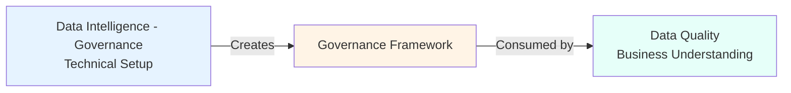

The [**Data Intelligence - Quality**](../Data_Intelligence_Quality/) lab consumes and interprets governance artifacts

### Complementary with Data Quality

| Aspect | Data Intelligence - Governance (Technical) | Data Quality (Business) |
|--------|-------------------|------------------|
| **Role** | Data Steward | Data Consumer |
| **Action** | Create & Implement | View & Understand |
| **Classifications** | Assign PII/SPI labels | Interpret what labels mean |
| **Business Terms** | Create and assign | Read and use |
| **Data Quality** | Configure checks | Review scores |
| **Data Protection** | Implement masking | See masked data |

### Lab Introduction

This lab will take you through the high-level steps to demonstrate how to profile data and run metadata enrichment.

Because we are working in a shared watsonx.data intelligence (wxi) environment, some of the steps were done for you in advance (steps in dark blue), including data protection rules.

Instructors will walk you through those implemented steps and how they influence your access to data and specific data fields.

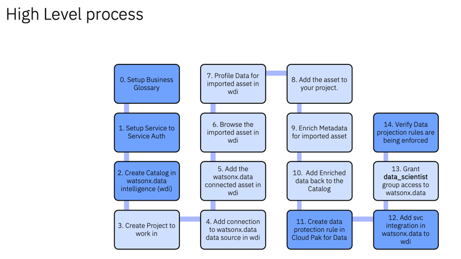


## 4. Lab Steps

### 4.1 Open watsonx.data Intelligence Service

* Open a new incognito window
* Login to https://cloud.ibm.com using the **non-admin** credentials provided by instructor
  
* From IBM Cloud Hamburger menu, select [**Resource List**](https://cloud.ibm.com/resources)
* Go to **AI/Machine Learning** -> **watsonx.data intelligence**
  
  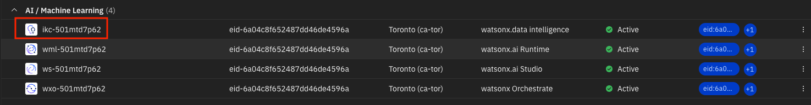


* In **Data Fabric** section click `Launch`

  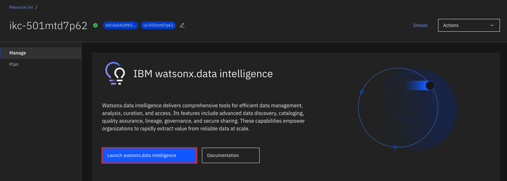


* If prompted for tour, Agree to terms and `Skip for now`

### 4.2 Create a Project

**Note:** The data curation process will also use a project like the **Data Lakehouse** lab; however, this project will be created in a shared watsonx.data environment within the Data Fabric context in order to leverage the data fabric capabilities of the service.

* From the Hamburger menu, select `Projects` → `View all Projects`

* Select `New Project`
* Name: `Data Intelligence - Governance FirstInitial+Lastname` to differentiate your project within the instance
* Select your Cloud Object Storage from the list if not selected by default
* Select `Create`

:warning: You might be requested to create a User API Key if you don't have one → then just click create

### 4.3 Import Connected Asset from Catalog

* Within the project, go to the **Assets** tab → `Import assets`
* In the left-hand menu, select **Catalog asset** → Choose bootcamp catalog → `Data asset` → Select the customers table created by the instructor
* Click `Import`
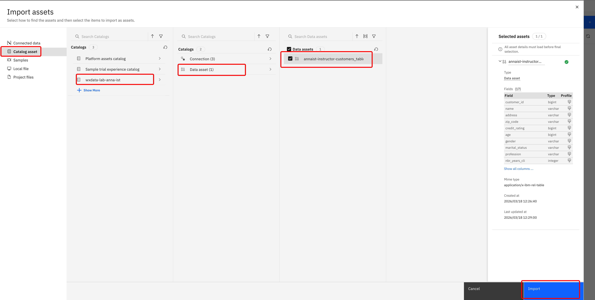

### 4.4 Browse the Imported Asset

* Select your Data Asset that you just imported
* Notice that you are currently able to view all fields
* On **Profile**, an overview of data with basic statistics will be automatically created
* **Data Quality** Tab is currently empty

### 4.5 Profile Data for Imported Asset

Profiling in watsonx.data intelligence involves analyzing columns of data assets to understand their structure and content. This analysis includes computing statistics about the data, determining data types and formats, classifying the data, and capturing frequency distributions.

* Select the `Profile` tab and click `Update profile` to start profiling (takes 5-10 mins) → meanwhile, you can perform other tasks

### 4.6 Enrich Data for Imported Asset

This step uses the automated Metadata enrichment tool to enrich the watsonx.data asset that was just imported via the Catalog.

Metadata enrichment uses pre-defined data classes and business terms to automatically assign or make suggestions during the metadata enrichment process. This saves organizations a tremendous amount of time and resources by alleviating the manual effort that would have been involved to accomplish the same result.

#### 4.6.1 Review Enrichment Options

* Go back to the project by clicking on its name in the link above
* Go to the **Manage** tab, select `Metadata enrichment` in the left-side menu
* Scroll down to **Term assignment** methods and make sure that the following options are selected:
  
  * Machine learning (A machine learning model is used to assign terms)
  * Data-class-based assignments (Terms are assigned based on the data class assignment for a column)
  * Name matching (Terms are assigned based on the similarity between a term and the name of the asset or column)
  * Gen AI based term assignment, if available (This option is available to a SaaS service with either a Trial or Premium license. With Gen AI based term assignment, domain-specific business terms are assigned and suggested by using LLM. The model takes into account names and descriptions of assets and columns, and semantically matches terms with that metadata, assigning terms even if they aren't exact matches.)
  
In Trial plan this option may be available:
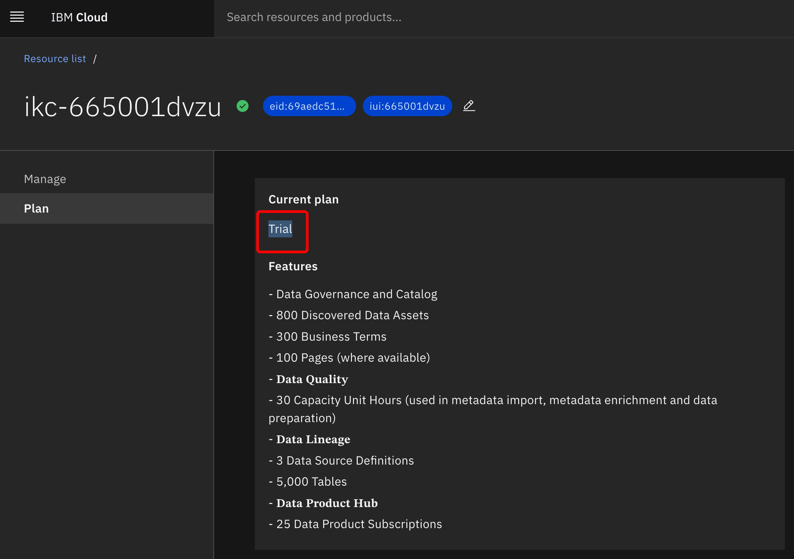
      

#### 4.6.2 Create Metadata Enrichment Job

* Switch back to the `Assets` tab
* Select `New Asset`
* Select `Enrich data assets with metadata`
* Enter Name: `MDE` and select `Next`
* Select `Select data from project`
* Under Asset types, select `Data asset` and `Your Table Name`, then click `Select`
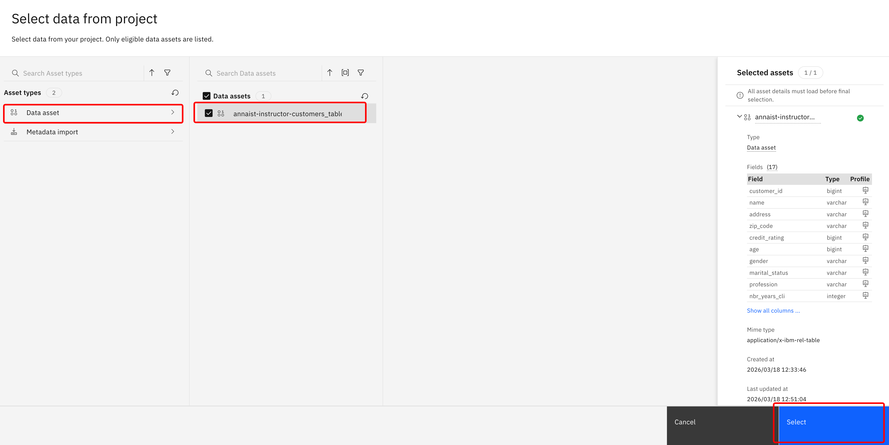
* Your asset should be selected. Select `Next`
* Set Enrichment Objectives by enabling the following options:
  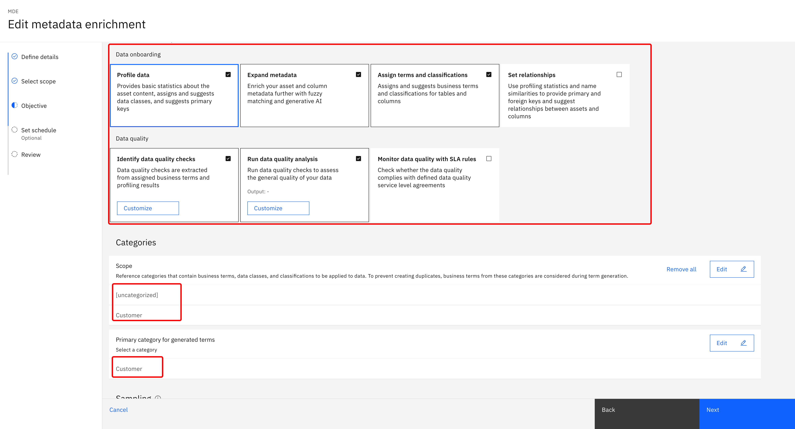
  * Profile Data
  * Expand Metadata
  * Assign terms and classifications
  * Identify data quality checks
  * Run data quality analysis
  

* Scroll down, select `Select categories +`
  * Select [uncategorized] and `Customer`, then click `Select`
  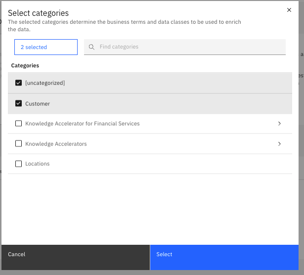<br>


* Primary category for generated terms → select the same `Customer`

* For the simplicity of the lab, keep the defaults `Basic` for Sampling
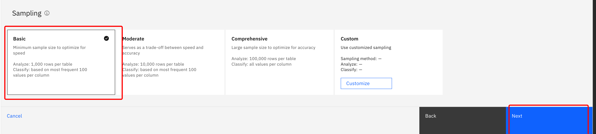
* Schedule enrichment Job and click `Next`


* Keep the defaults to run the job now and click `Next`
 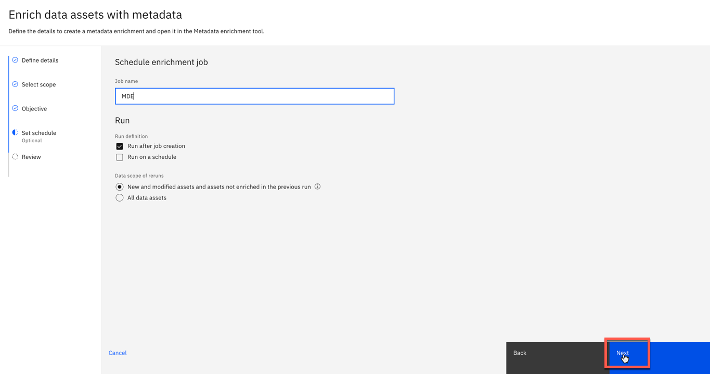<br>
* Enrichment options will be displayed. Select `Create` to start the job
  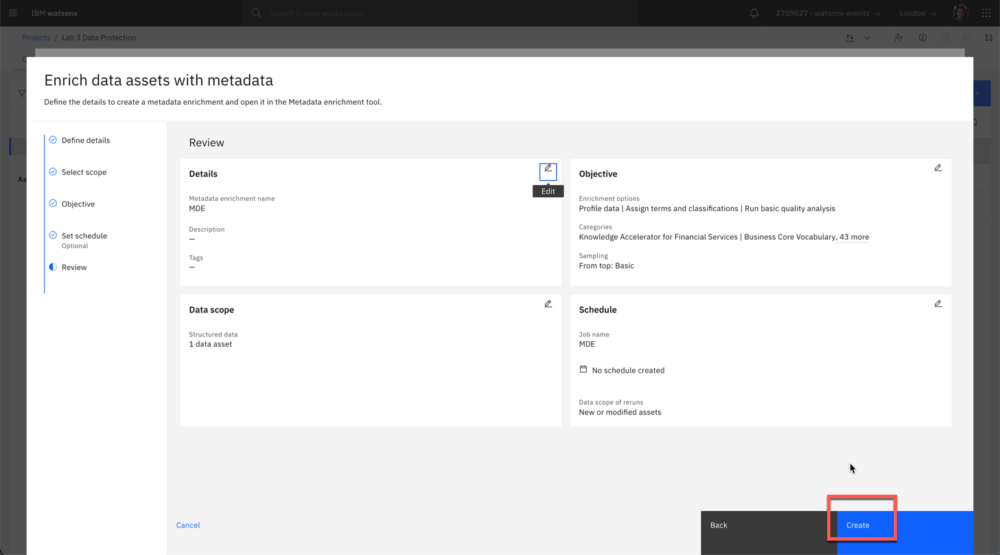<br>


> Based on the enrichment scope and objectives, the Metadata enrichment tool automatically profiles the data, analyzes and assessed data quality, assigns and suggests business terms, and assigns data classes to all columns for the data asset included in the metadata enrichment job.

* The enrichment process will take approximately 5 minutes to complete. The status of an enrichment job can be checked in the **Jobs** tab of the project. After clicking on the **MDE** job name, it should gradually change from `Started` to `Running` to `Completed`.

#### 4.6.3 Review Enrichment Results

As the data steward, you will now review the proposed enrichment before publishing it to the catalog for others to consume.
> Here we will go through some examples. Remaining metadata enrichment review can be done by participants if time allows.

* From the **Assets** tab, go to Metadata Enrichment asset `MDE`
* Go to the **Columns** tab of the asset where you see the results of the Metadata Enrichment job
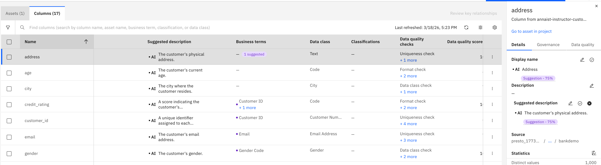
Some of the metadata are generated using AI, while others are assigned based on the governance artifacts. Where confidence thresholds are met, it automatically assigns metadata or governance artifacts. When the model fails to meet the enrichment threshold set, it will make a suggestion (in purple).

Let's explore:
* Click on the first column `address`
* On the right side panel, you will see metadata relevant to this field
  * First, go to the **Details** tab. Here you see suggestions for Display name and Description generated by AI
  * You can edit that suggestion if needed (click on the pencil) or just accept it by clicking `Accept AI suggestion`
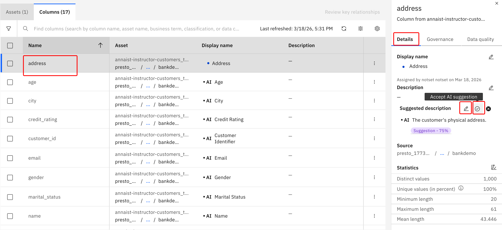
  * Then move to the **Governance** tab. Here we will reject the suggested business term `Email` and rather select a Business Term manually with the `+` button
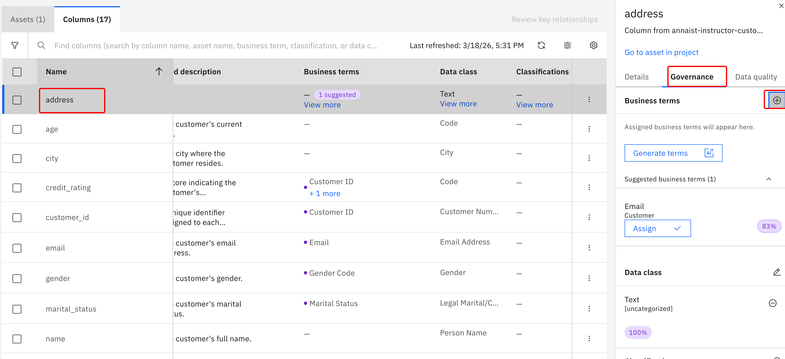
  * Select `Address` from the list and click `Assign`

* Click on the purple `1 suggested` bubble next to `risk_score`, then select the `Governance` tab on the right side and review the suggestion
* Select the `Assign` button to accept the suggestion
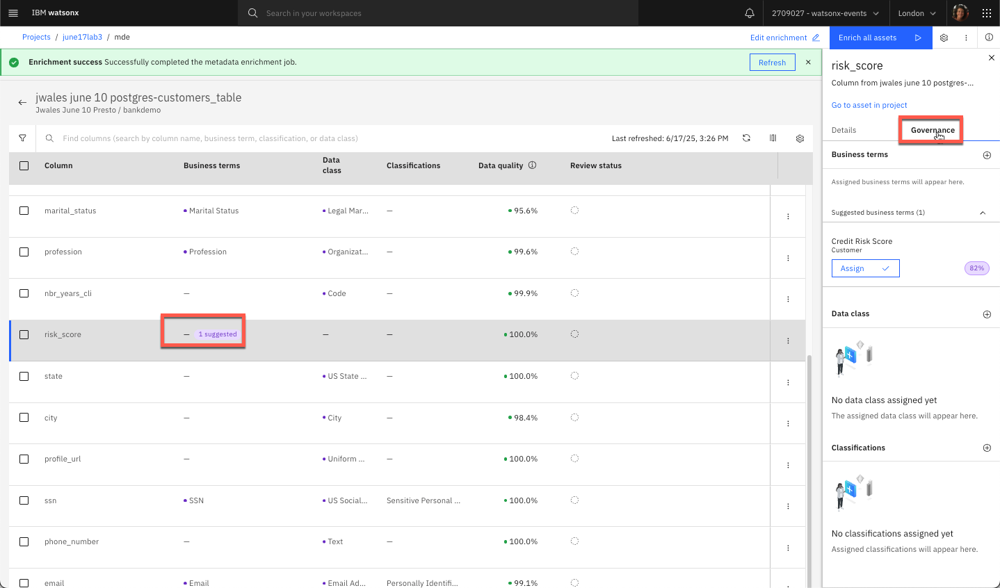<br>

In cases where there may be ambiguity in the business term, the model may not make a suggestion.

* Hover over the business term column for `Address` and select `View more`
* Select the `Governance` tab on the right side and select the `+` button
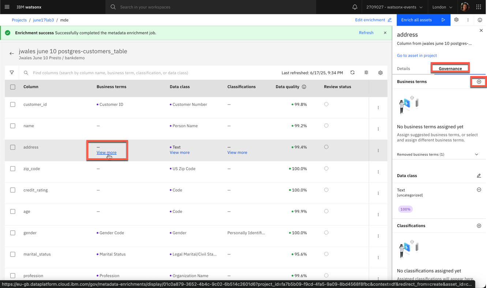<br>
* In the search bar, type `address`
* Select `Work Address` and `Assign`. Think about why it was not assigned during the enrichment job.
* The **Data quality** tab shows you the criteria based on which the data quality score was calculated
* Repeat for the `ssn` and `email` fields
* Accept suggested Display names and Descriptions
* On the `ssn` field, review the assigned `Business terms` and `Data Class` and set them to `SSN` and `US Social Security Number` if they were not automatically assigned
* Optionally review the `Classifications` and set to `Sensitive Personal Information`
* On the `email` field, review the assigned `Business terms` and `Data Class` and set them to `Email` and `Email Address` if they were not automatically assigned
* Optionally review the `Classifications` and set to `Personally Identifiable Information`

* Scroll to the right and explore the available metadata and data quality scores
* To understand the quality score, click on the number and see how it was evaluated
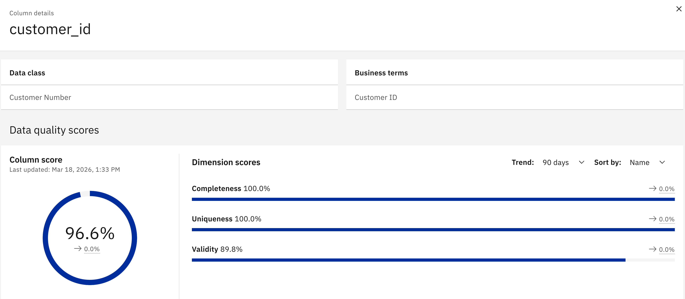
* Change the review status of the fields that you have updated by clicking on the 3-dots at the right end of the row and selecting `Mark as reviewed`

When you are happy that your data is now properly identified and ready to be governed, the enriched asset can be published back to the catalog. For this bootcamp, **the instructor has already published a pre-enriched version of the asset** to the shared catalog so we can proceed directly to verifying data protection.

#### 4.6.4 Instructor-Published Asset in the Catalog

The instructor has completed the publish step in advance. When you navigate to the bootcamp catalog you will see the enriched asset already available with:
- Business terms assigned to each column
- AI-generated descriptions
- Data quality scores
- Classifications (PII / SPI)
- Active data protection rules

Now when you return to the catalog, you will see that metadata and governance artifacts are present on the selected asset:
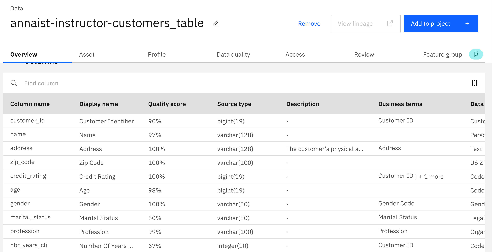


## 5. Verify Data Protection

### 5.1 See Data Protection in Action

The instructor will demonstrate data protection enforcement live. Here is what is happening and what to observe:

* In the watsonx.data **Query Workspace**, the following query is run against the Postgres data source:

```sql
SELECT *
FROM postgres_catalog_20260922_1602.bankdemo.customers_table
LIMIT 10;
```

* The query runs on **presto_engine** — the Presto engine that has the IBM Knowledge Catalog integration active

* The results show the `customers_table` data with masking enforced on the sensitive columns:

  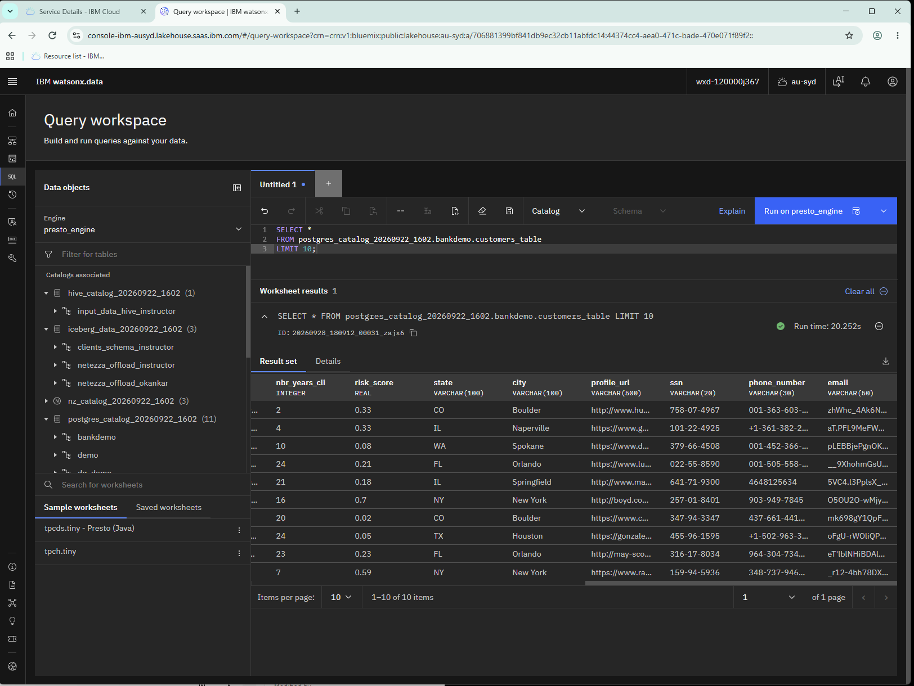

**What to look at in the results:**

| Column | What you see | Why |
|---|---|---|
| `ssn` | Format-preserved fake values e.g. `758-07-4967` | Business term `SSN` triggered the "Protect US Social Security Numbers" rule |
| `email` | Obfuscated values e.g. `zhWhc_4Ak6N...` | Business term `Email` triggered the "Protect Email Addresses" rule |
| All other columns | Real values | No matching business term → no protection rule fires |

> **Key point:** The raw data in Postgres is unchanged. The masking is applied dynamically at query time by the Presto engine — enforced because the IBM Knowledge Catalog integration is active and the business terms `SSN` and `Email` are assigned to those columns.

### Understanding Your Results

What you see in the query results depends on the access role your account has on the Postgres data source. There are two possible outcomes — both are valid and expected depending on how your instructor configured the environment:

| What you see | What it means |
|---|---|
| **Email and SSN columns show realistic-looking but fake values** | ✅ Data protection rules are working. Your account has a non-admin (`User` / `Reader`) role on the Postgres data source. The masking rule matched the `Email` and `SSN` business terms on those columns and obfuscated the values before returning them to you. |
| **Email and SSN columns show real values** | Your account has `Admin` access on the Postgres data source. Admin/owner accounts are intentionally exempt from data protection rules — this is by design, not a misconfiguration. The instructor retains this access to manage the environment. In a production deployment, business analysts and data consumers would always have non-admin access and would see masked data. |

> **The key concept either way:** The masking is not applied to the raw data in Postgres — it never changes. Masking is applied dynamically at query time based on your identity and the business terms assigned to each column. The same query, run by two different users with different roles, returns different results. That is the governance model in action.

In this lab, you have demonstrated that watsonx.data allows data stewards to enrich and catalog data just like any other data in their enterprise.


## Key Takeaways

After completing this lab, you'll understand:

✅ **AI-Powered Enrichment:** How AI can accelerate metadata enrichment by 80%

✅ **Data Profiling:** The importance of data profiling for governance

✅ **Data Classification:** How to classify and protect sensitive data (PII/SPI)

✅ **Business Terms:** The role of business terms in data standardization

✅ **Data Quality:** How data quality is measured and reported

✅ **Governance Workflow:** The complete workflow from raw data to governed asset

✅ **Data Protection:** Implementation of masking rules for sensitive fields


## Troubleshooting

**Issue: Cannot create project**
- Solution: Verify you're in the correct IBM Cloud account

**Issue: Enrichment job fails**
- Solution: Check CUH availability, may need to wait for capacity

**Issue: Cannot see catalog**
- Solution: Verify instructor has granted you access

**Issue: Data protection not working**
- Solution: Ensure rules were configured by instructor in advance


## Next Steps

### Business Value

This lab demonstrates how organizations can:
- **Automate** governance with AI (80% time savings)
- **Protect** sensitive data while maintaining utility
- **Standardize** data definitions across the enterprise
- **Ensure** compliance with regulations (GDPR, CCPA, HIPAA)
- **Improve** data quality and trustworthiness

### Important Notes

**Shared Environment:**
- Work in a shared watsonx.data intelligence instance
- Use unique naming: `Data Intelligence Governance FirstInitial+Lastname`
- Only one person publishes to the shared catalog

**Trial License Limitations:**
- Limited to 30 CUH (Capacity Unit Hours)
- Only 5-6 active participants recommended
- Others can observe and learn concepts

**Pre-configured Elements:**
Instructors have pre-configured:
- Bootcamp catalog
- Governance artifacts (categories, business terms)
- Data protection rules
- Service-to-service authorization

### Related Labs

- [Data Discovery and Exploration](../Data_Discovery/README.md)
- [Data Intelligence - Quality](../Data_Intelligence_Quality/README.md)
