# Natural Language to SQL Agent

## Table of Contents
- [1. Introduction](#1-introduction)
- [2. Prerequisites](#2-prerequisites)
- [3. Lab Overview](#3-lab-overview)
- [4. Create NL2SQL Agent in watsonx Orchestrate](#4-create-nl2sql-agent-in-watsonx-orchestrate)
- [5. Test the NL2SQL Agent](#5-test-the-nl2sql-agent)
- [6. Business Use Cases](#6-business-use-cases)
- [7. Understanding How It Works](#7-understanding-how-it-works)
- [8. Troubleshooting](#8-troubleshooting)
- [Key Takeaways](#key-takeaways)
- [Next Steps](#next-steps)


## 1. Introduction

In this lab, you'll create a **Natural Language to SQL (NL2SQL)** agent that understands natural language questions and automatically converts them into SQL queries to retrieve data from watsonx.data. Unlike traditional methods that require SQL knowledge, this agent allows business users to ask questions in plain English and get accurate answers from your data lakehouse.

### What This Lab Demonstrates

- **No coding required** - Build the agent entirely through the watsonx Orchestrate UI
- **Direct data access** - Connects directly to watsonx.data without intermediate deployments
- **Business-friendly** - Designed for analysts, managers, and other non-technical users
- **Intelligent query generation** - Automatically converts questions to SQL
- **Multi-table joins** - Handles complex queries across multiple data sources

### What You'll Learn

By the end of this lab, you will be able to:

1. ✅ Create an agent that turns questions into SQL without coding
2. ✅ Connect the agent to watsonx.data
3. ✅ Configure agent behavior and guidelines
4. ✅ Test and deploy the agent for production use
5. ✅ Troubleshoot common issues

### What You'll Build

An intelligent agent that:

1. Accepts natural language questions from users
2. Analyzes the question to understand intent
3. Generates appropriate SQL queries
4. Executes queries against watsonx.data
5. Generates insights and suggests relevant follow-up questions
6. Formats and presents results in a user-friendly way

### Architecture

```txt
User Question (Natural Language)
        ↓
watsonx Orchestrate Agent
        ↓
LLM analyzes question → Generates SQL
        ↓
SQL Query Tool → watsonx.data (Presto)
        ↓
Query Results → Formatted Response
        ↓
User receives answer
```

**Time Required:** 45-60 minutes


## 2. Prerequisites

Before starting this lab, ensure you have:

- ✅ Completed [Getting Started Setup Guide](../Getting_Started/README.md) Section 1 if not already completed
- ✅ Access to **watsonx Orchestrate** instance
- ✅ Access to **watsonx.data** instance with data loaded
- ✅ Your instructor has provided a custom `sql_agent_behavior.txt` file in the [assets](assets) folder
- ✅ Basic understanding of the data structure - see [Data Discovery Lab](../Data_Discovery/README.md)


## 3. Lab Overview

### Data Sources

This lab uses the following tables:

- `postgres_catalog.bankdemo.customers_table` - Customer information
- `iceberg_data.clients_schema_xxx.accounts_table` - Account details
- `iceberg_data.clients_schema_xxx.holdings_table` - Investment holdings

### Lab Steps

The lab consists of the following main steps:

1. **Access watsonx Orchestrate** - Launch the platform
2. **Configure watsonx.data connection** - Set up MCP server connection
3. **Create New Agent** - Build the NL2SQL agent
4. **Add Tools** - Connect watsonx.data query tools
5. **Configure Behavior** - Define agent instructions
6. **Add Guidelines** - Set rules and boundaries
7. **Test in Preview** - Validate functionality
8. **Deploy Agent** - Make it production-ready
9. **Production Testing** - Verify in live environment


## 4. Create NL2SQL Agent in watsonx Orchestrate

### 4.1 Access watsonx Orchestrate

1. **Navigate to IBM Cloud Resources:**
   - Go to [IBM Cloud Resources](https://cloud.ibm.com/resources)
   - Under **AI / Machine Learning**, find your **watsonx Orchestrate** instance
   - Click **Launch watsonx Orchestrate**

     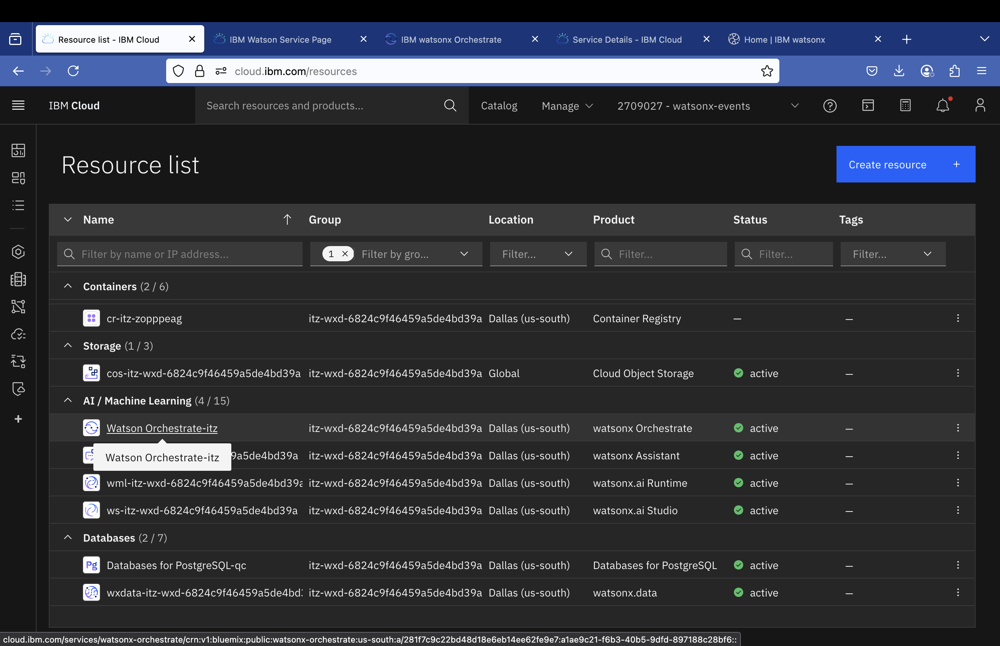

### 4.2 Configure watsonx.data Connection

Before the agent can query data, it needs to be connected to watsonx.data.

🗂️ **Follow this guide:**

[Configure watsonx.data remote MCP Server connection](watsonxdata_connection.md)

### 4.3 Create New Agent

1. **Access the Build Interface:**
   - From the hamburger menu (☰) on the top left
   - Select **Build**
   - This opens the agent builder interface

     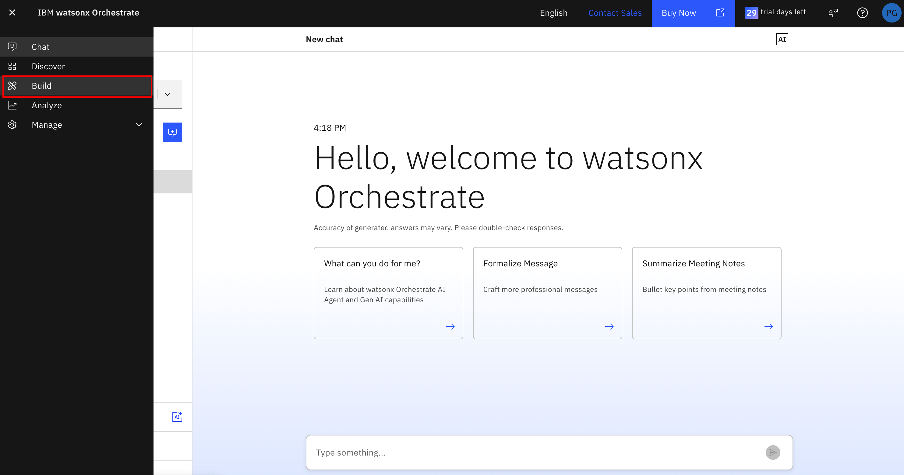

2. **Start Agent Creation:**
   - Click **Create Agent** button

     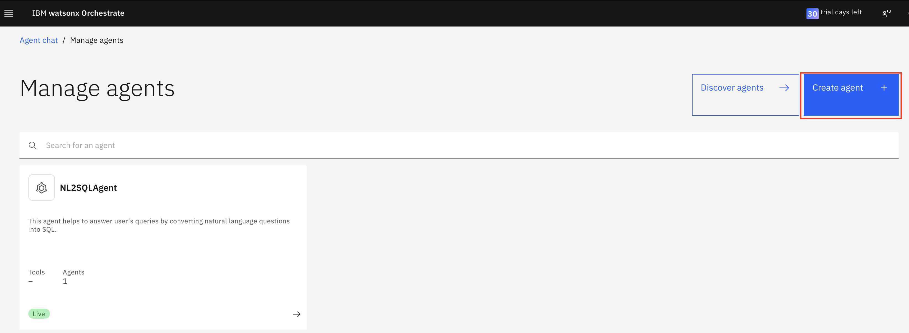

   - Select **Create from Scratch**
  
     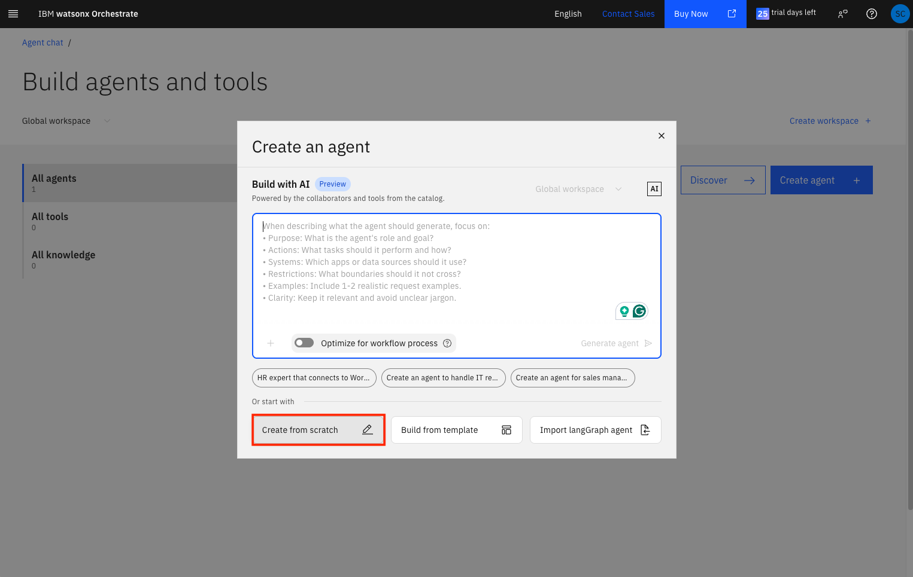


3. **Configure Basic Information:**
   - **Name:** `NL2SQL Agent - [Your Name]`
   - **Description:**

     ```txt
     Natural language interface to query watsonx.data. Ask questions about customers, accounts, holdings, and transactions in plain English - no SQL required.
     ```

4. **Configure Profile:**
   - You should now see the agent configuration page
   - The left panel shows **Configuration** options
   - The top navigation bar shows **Build**, **Evaluate**, **Deploy** options
   - The right panel shows **Preview** for testing

     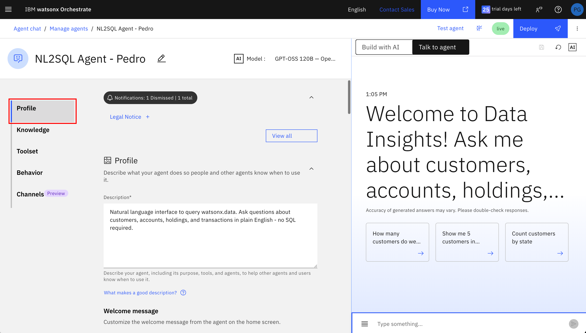

   - Click **Deploy**, **Orchestrate Chat** dropdown
   
   - Click **Edit** and create a **Welcome Message:**

     ```txt
     Welcome to Data Insights! Ask me about customers, accounts, holdings, or transactions
     ```

   - Create 3 **Quick start prompts:**

     ```txt
     How many customers do we have?
     ```

     ```txt
     Show me 5 IBM holdings
     ```

     ```txt
     What's the total balance across all accounts?
     ```

     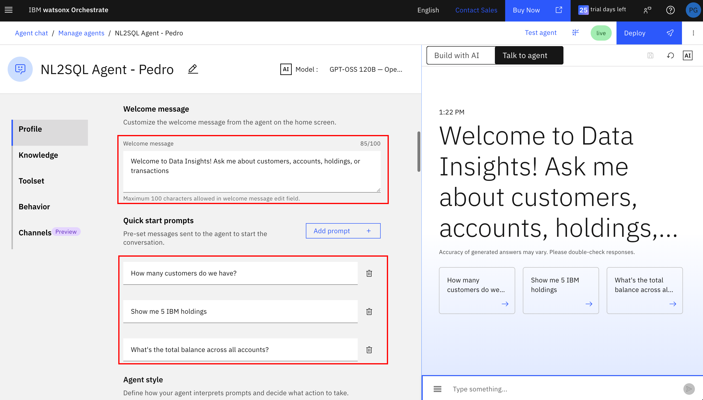


### 4.4 Add watsonx.data MCP Server Tools

Now we'll add the watsonx.data server tools that execute SQL queries against watsonx.data.

1. **Manage MCP Servers**
   - In the **Toolset** section
   - Under **Tools**, click **Add tool**
    
     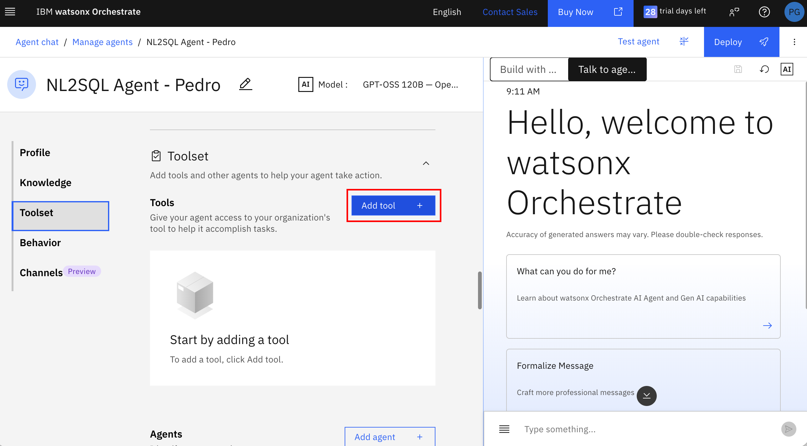

   - Select **MCP server**

     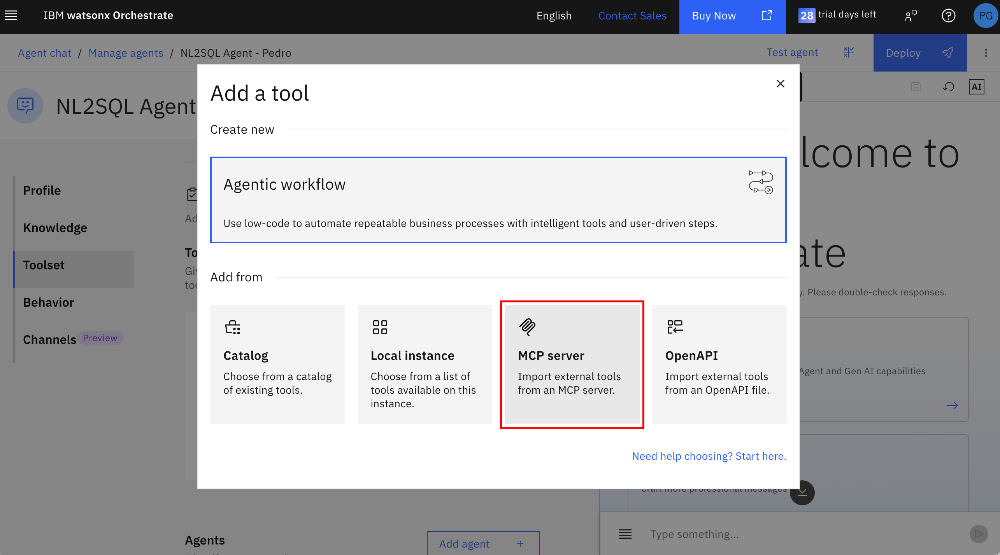

   - Select **Manage MCP Servers**

   - Ensure `watsonx-data-mcp-server` is available.
   - Close the window


2. **Add Tools:**
 - In the **Toolset** section
   - Under **Tools**, click **Add tool**
    
     

   - In `Local Instance`, search for the following tools:
     - `watsonxdata-list-engines`: list available Presto and Spark compute engines in watsonx.data
     - `watsonxdata-list-schemas`: List database schemas in a watsonx.data catalog
     - `watsonxdata-list-tables`: List tables in a watsonx.data schema
     - `watsonxdata-describe-table`: Get detailed schema and metadata for a watsonx.data table
     - `watsonxdata-execute-select`: Execute read-only SELECT queries against watsonx.data
   - Select each tool and click: **Add to agent**

     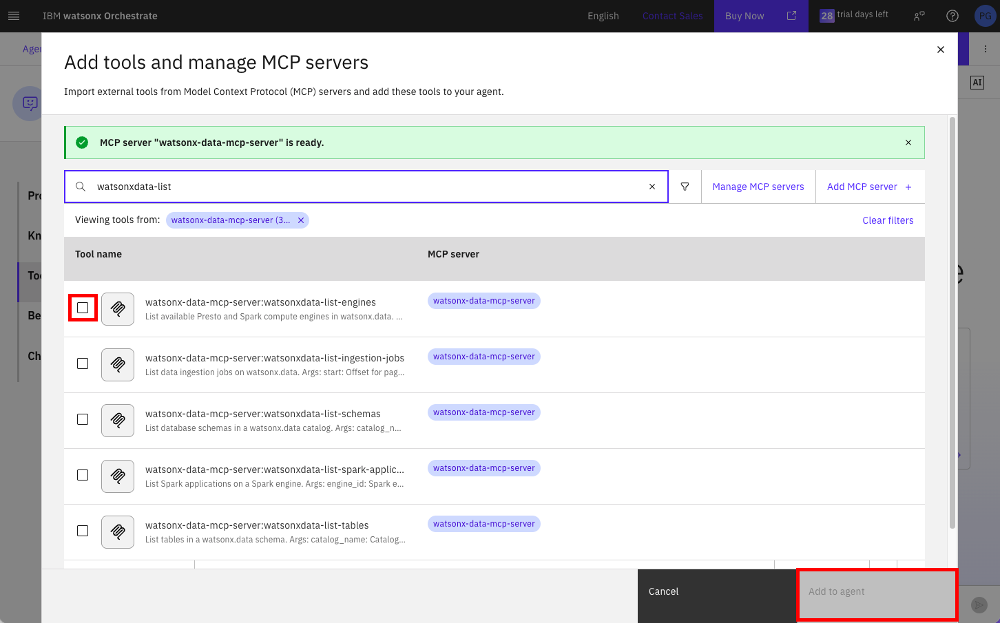

### 4.5 Configure Agent Behavior

This is where we define how the agent should behave and what instructions it should follow.

1. **Create Agent Behavior:**
   - Verify that there is an `sql_agent_behavior.txt` file in the [assets](./assets) folder that has accurate values for the catalogs according to your `env.txt` file. If not, follow this guide [Create Behavior file](./automation/behavior/README.md) to create it

1. **Add Agent Instructions:**
  
   - Paste the contents of the generated **sql_agent_behavior.txt** file into the **Behavior** -> **Instructions** field:

     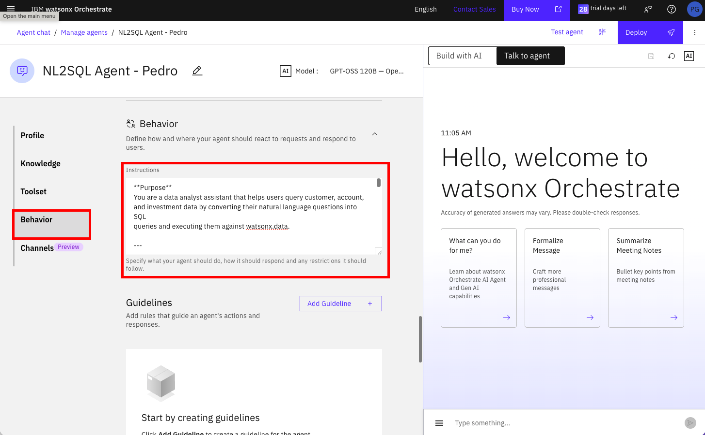

### 4.6 Add Guidelines

While the behavior instructions provide the "how," guidelines/rules provide the "must/must not" boundaries.

- As an example you can add the guidelines/rules from the file [Guidelines](./assets/Guidelines.md):

- Click **Add Guideline**

  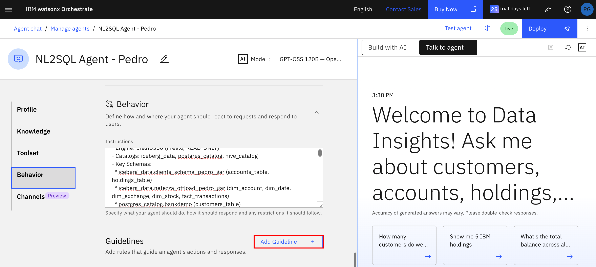

- For each rule, configure `Name`, `Condition` & `Action` values as defined in the [Guidelines](./assets/Guidelines.md) file

- Click **Save**

  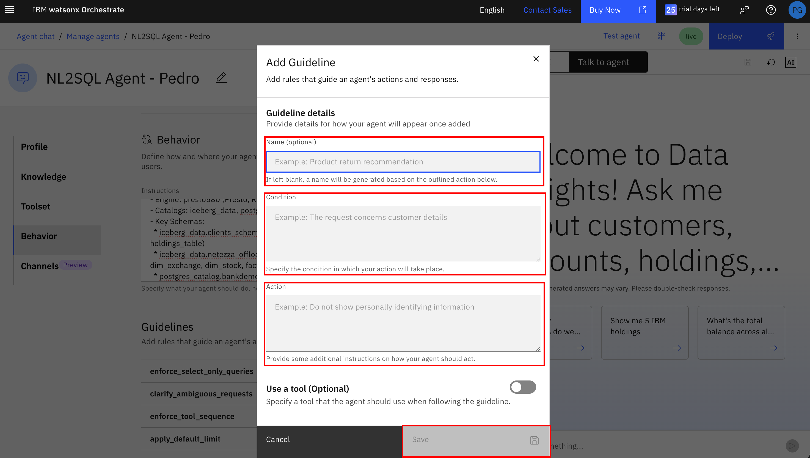


## 5. Test the NL2SQL Agent

### 5.1 Preview Mode Testing

Before deploying, let's test the agent in preview mode.

1. **Open Preview Panel:**
   - The preview panel should be visible on the right side

     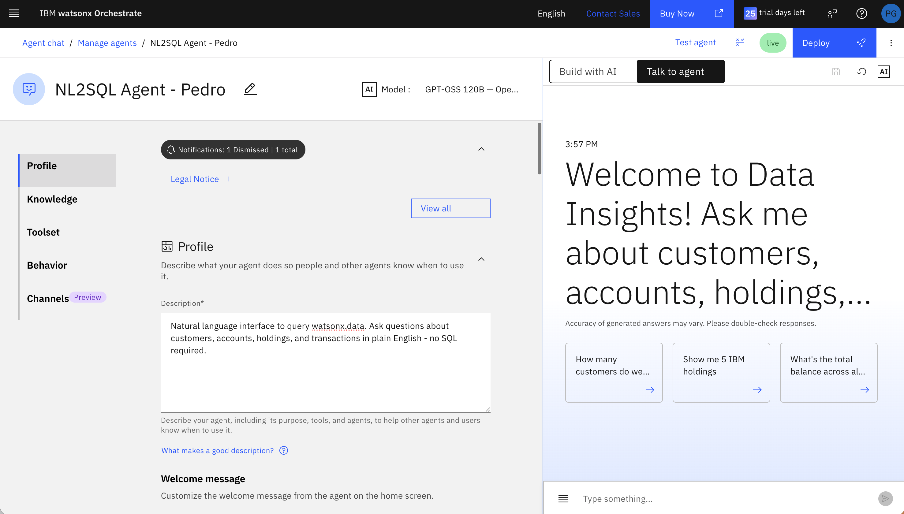

2. **Start a Conversation:**
   - In the chat input, type: `Hello, what can you do?`
   - The agent should greet you and explain its capabilities

     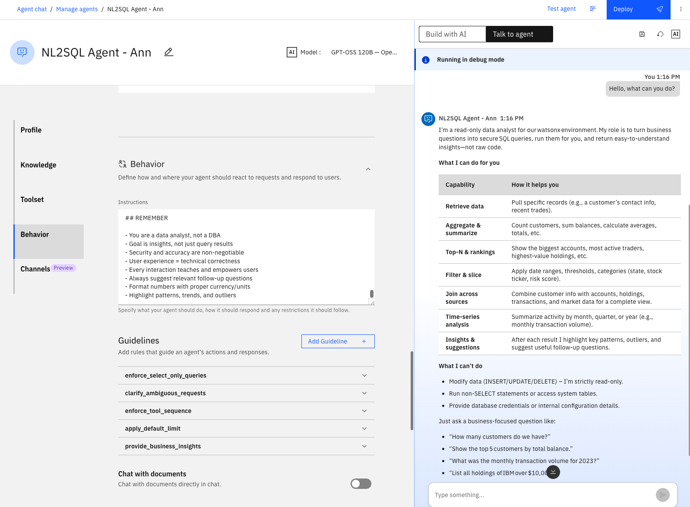

3. **Test Simple Query:**

   **Test 1: Customer Lookup**

   ```txt
   Who are the 5 oldest customers?
   ```

   **Expected behavior:**
   - Agent generates a SQL query:
     - Select customers table
     - Filter by age
     - Return the top 5
     ```sql
     SELECT customer_id, name, age FROM postgres_catalog.bankdemo.customers_table ORDER BY age DESC LIMIT 5
     ```
   - Executes query against watsonx.data
   - Returns:
     - List of oldest customers
     - Key Insights from the results
     - Suggested Follow-up questions

     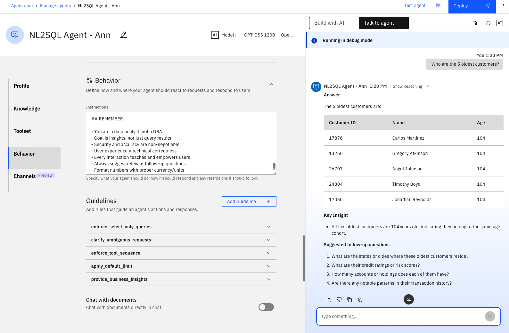

4. **Test Complex Query:**

   **Test 2: Investment Analysis**

   ```txt
   Who are the top 5 customers with the highest total investment value in holdings?
   ```

   **Expected behavior:**
   - Agent gets info from the different tables using `list` and `describe` tools
   - Agent generates SQL query:
     - Join customers, holdings and accounts tables
     - Calculate total value (SUM (holding.amt))
     - Group by customer
     - Return top 5 customers with the highest total investment
     ```sql
     SELECT c.customer_id, c.name, SUM(h.holding_amt) AS total_investment FROM iceberg_data_20260513_1540.clients_schema_instructor.holdings_table h INNER JOIN iceberg_data_20260513_1540.clients_schema_instructor.accounts_table a ON h.account_id = a.account_id INNER JOIN postgres_catalog.bankdemo.customers_table c ON a.customer_id = c.customer_id GROUP BY c.customer_id, c.name ORDER BY total_investment DESC LIMIT 5
   - Executes query against watsonx.data
   - Returns:
     - List of top 5 customers
     - Key Insights from the results
     - Suggested Follow-up questions

     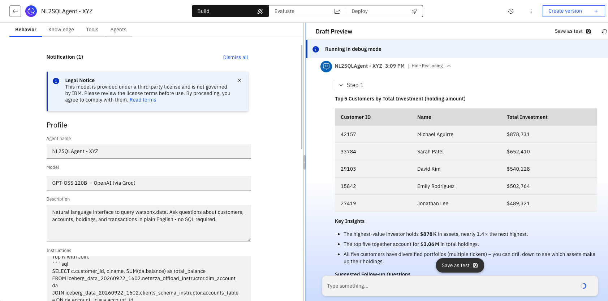

5. **Test Join Query:**

   **Test 3: Cross-Table Query**

   ```txt
   List all customers who have invested in IBM and show their holdings
   ```

   **Expected behavior:**
   - Agent gets info from the different tables using `list` and `describe` tools
   - Agent generates SQL query:
     - Join customers, holdings and accounts tables
     - Filter for IBM ticker
     - Return customer names with holding details
     ```sql
     SELECT c.customer_id, c.name, h.asset_ticker, h.holding_amt FROM iceberg_data_20260513_1540.clients_schema_instructor.holdings_table h INNER JOIN iceberg_data_20260513_1540.clients_schema_instructor.accounts_table a ON h.account_id = a.account_id INNER JOIN postgres_catalog.bankdemo.customers_table c ON a.customer_id = c.customer_id WHERE h.asset_ticker = 'IBM' ORDER BY h.holding_amt DESC LIMIT 100
     ```
   - Executes query against watsonx.data
   - Returns:
     - List of customers
     - Key Insights from the results
     - Suggested Follow-up questions

     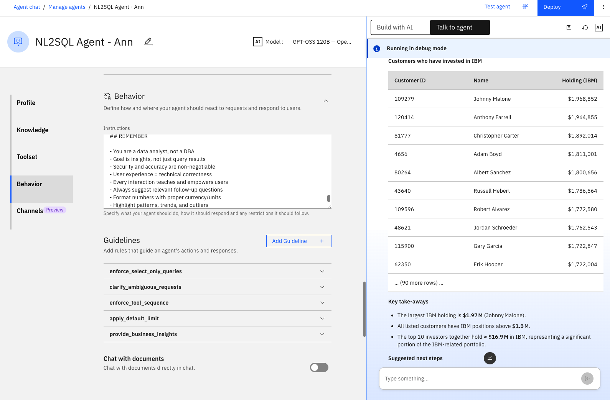

6. **View Query Reasoning:**
   - Click **Show reasoning** in the response
   - Expand **Step 1** to see the tool used
   - Review how the agent interpreted your question and generated SQL query

     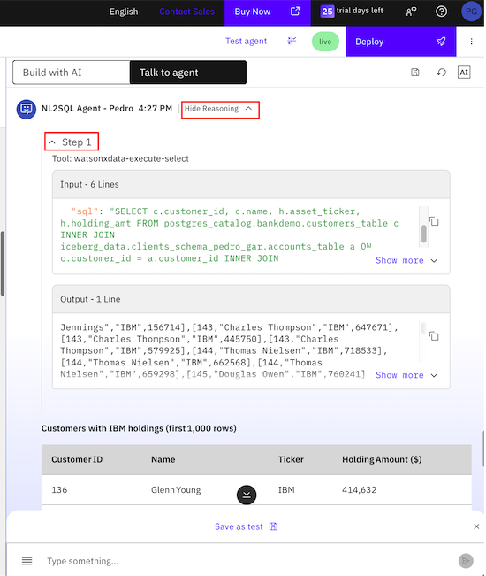

### 5.2 Deploy the Agent

Once testing is successful, deploy the agent for production use.

1. **Initiate Deployment:**

   - Click **Deploy** button in the top navigation bar

     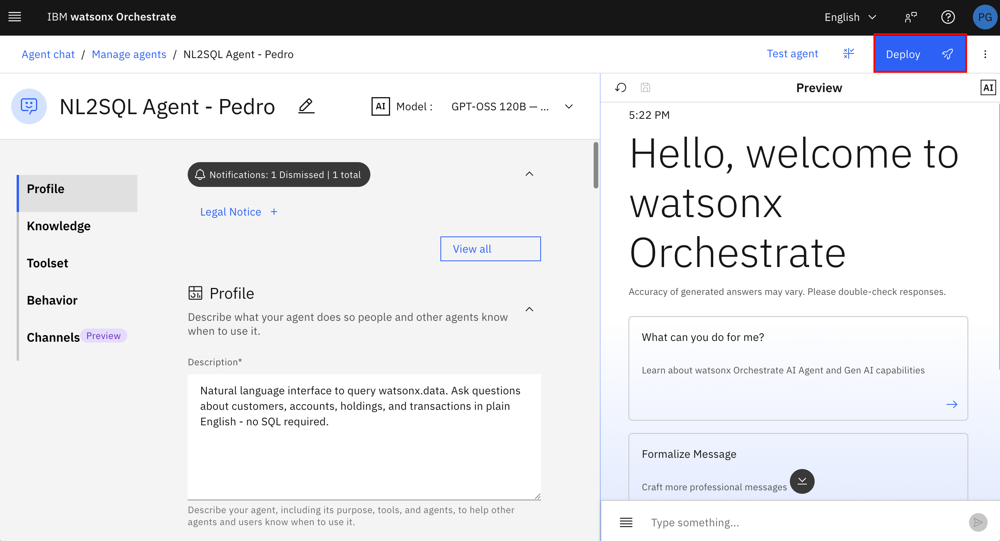
 
   - Click **Deploy to Live**, **Create New Version**

   - Enter version name - **Version Name:** `Prod Agent - [Initials]`

   - Enter version number - **Version Number:** `1.0.0`

   - Review the **Pre-deployment summary** and click **Create**

     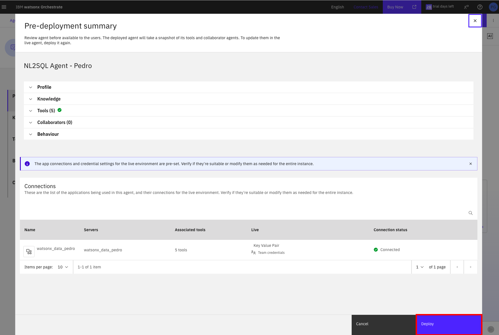

2. **Wait for Deployment:**
   - Deployment typically takes 1-2 minutes
   - Status indicator shows progress
   - Wait for "Deployed successfully" message

### 5.3 Production Testing

Test the deployed agent in the production chat interface.

1. **Access Chat Interface:**
   - From the hamburger menu (☰)
   - Select **Chat**
   - From the **Agents** dropdown, select your deployed agent

     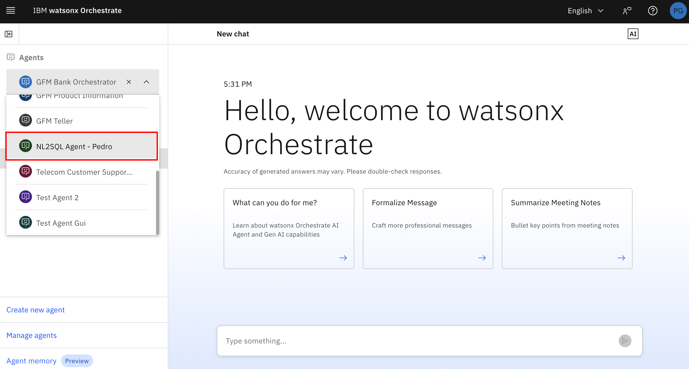

2. **Run Production Tests:**

   **Test Query 1: Account Balances**

   ```txt
   What are the top 10 accounts by balance?
   ```

   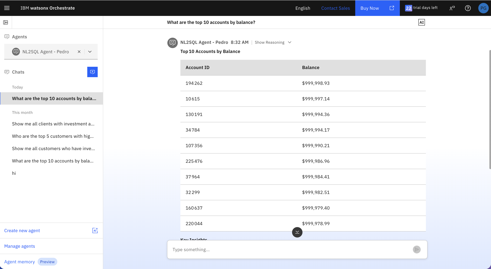

   **Test Query 2: Investment Holdings**

   ```txt
   Show me all customers who have invested more than $50,000 in total
   ```

   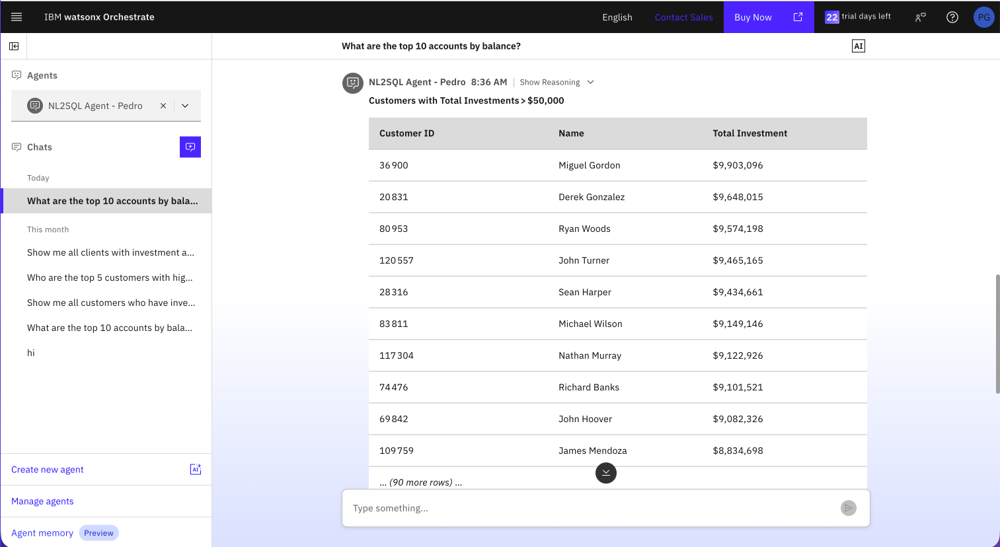

   **Test Query 3: Specific Customer**

   ```txt
   What stocks does Kevin Wilcox own?
   ```

   - The agent finds two customers with the same name, so it asks for clarification

     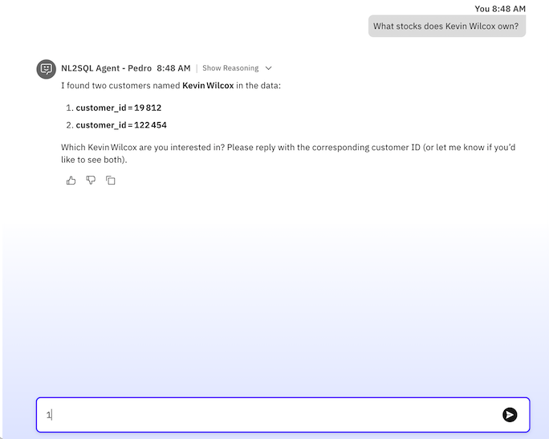

   - Type `1`

     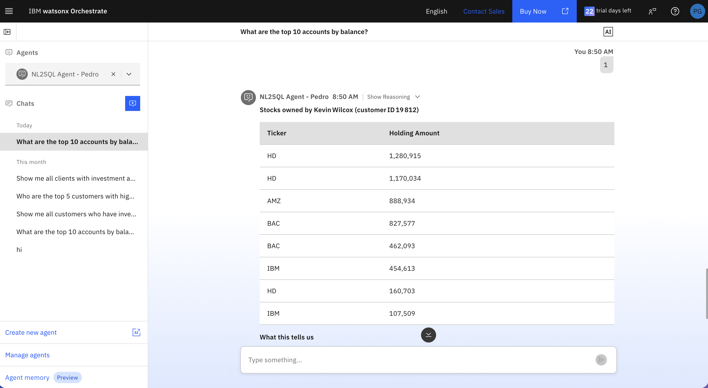

   **Test Query 4: Aggregation**

   ```txt
   What's the average account balance across all customers?
   ```

   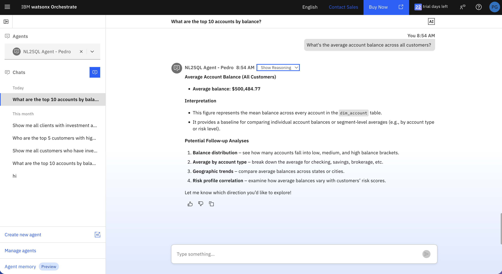

3. **Verify Accuracy:**

   - Compare results with [Data Discovery Lab](../Data_Discovery/README.md)
   - Check that numbers make sense
   - Verify formatting is clear and professional


## 6. Business Use Cases

Use these business use cases to additionally test your agent:

[Business use cases](./Business_use_cases.md)


## 7. Understanding How It Works

Check the following document if you want to learn how the AI agent operates in practice. You'll see how it understands natural‑language questions, translates them into SQL, and executes those queries across different databases to return accurate results.

[How it works](How_it_works.md)


## 8. Troubleshooting

### 8.1 Common Issues and Solutions

#### Issue 1: "Connection failed" Error

**Symptoms:**
- Agent cannot connect to watsonx.data
- Tool calling fails immediately

**Solutions:**
1. Verify connection credentials in `env.txt`
2. Check that watsonx.data instance is running
3. Confirm network connectivity
4. Re-test connection in Orchestrate
5. Verify MCP server is configured in Orchestrate

#### Issue 2: "No data returned" for Valid Queries

**Symptoms:**
- Query executes but returns empty results
- You know data should exist

**Solutions:**
1. Verify table names are correct (catalog.schema.table)
2. Check that data was loaded in Labs 1-2
3. Test query directly in watsonx.data UI 
4. Verify filters aren't too restrictive
5. Check for case sensitivity in string comparisons

#### Issue 3: Agent Generates Incorrect SQL

**Symptoms:**
- SQL syntax errors
- Wrong tables or columns used
- Query doesn't match question intent

**Solutions:**
1. Review agent instructions for clarity
2. Add more example queries to instructions
3. Provide clearer data schema information
4. Rephrase your question more specifically

#### Issue 4: Slow Query Performance

**Symptoms:**
- Queries take longer than 30 seconds
- Timeout errors

**Solutions:**
1. Add LIMIT clauses to large queries
2. Optimize query with proper indexes (instructor task)
3. Increase timeout in tool configuration
4. Break complex queries into simpler ones
5. Check watsonx.data performance

#### Issue 5: Agent Doesn't Understand Question

**Symptoms:**
- Agent asks for clarification repeatedly
- Generates irrelevant queries

**Solutions:**
1. Rephrase question more clearly
2. Be more specific about what you want
3. Use terminology from the data schema
4. Provide example of expected output
5. Break complex questions into parts

### 8.2 Getting Help

If you encounter issues not covered here:

1. **Check Agent Reasoning:**
   - Click "Show reasoning" in responses
   - Review the generated SQL query
   - Identify where the process breaks down

2. **Test Components Separately:**
   - Test connection independently
   - Try simple queries first
   - Verify data exists. See [Data Discovery Lab](../Data_Discovery/README.md)

3. **Review Configuration:**
   - Double-check all connection settings
   - Verify MCP server and tool configurations
   - Review agent instructions

4. **Ask Your Instructor:**
   - Provide specific error messages
   - Share the question you asked
   - Show the generated SQL (from reasoning)


## Key Takeaways

✅ **No-Code Solution:** Built a powerful NL2SQL agent without writing any code

✅ **Business Accessibility:** Made data accessible to non-technical users through natural language

✅ **Intelligent Query Generation:** Agent automatically converts questions to optimized SQL

✅ **Multi-Source Queries:** Handles complex joins across multiple tables and catalogs

✅ **Production Ready:** Deployed a scalable solution for enterprise use

✅ **Time Savings:** Eliminates dependency on IT/data teams for routine queries

✅ **Consistent Results:** Automated queries reduce errors and maintain consistency


## Next Steps

### Basic Actions

1. Try asking different types of questions
2. Explore your own business data
3. Share the agent with your team
4. Collect feedback and make small improvements

### Advanced Options

1. Add more data sources
2. Create agents for specific teams or use cases
3. Integrate with other business tools
4. Set up monitoring and analytics

### Resources

**Documentation:**
- [watsonx Orchestrate Agent Builder Guide](https://www.ibm.com/docs/en/watsonx/watson-orchestrate/base?topic=building-agents)
- [watsonx.data SQL Reference](https://www.ibm.com/docs/en/watsonxdata/standard/2.3.x?topic=data-running-sql-queries)
- [watsonx.data Remote MCP server](https://cloud.ibm.com/docs/watsonxdata?topic=watsonxdata-remote-querying-data-ai-end)
- [Presto SQL Documentation](https://www.ibm.com/docs/en/watsonxdata/standard/2.3.x?topic=presto-sql-statements)

**Support:**
- [watsonx Orchestrate Community](https://community.ibm.com/community/user/groups/community-home?CommunityKey=3ad46381-9535-462e-85c9-568b21f4b067)
- [IBM Support Portal](https://www.ibm.com/mysupport/s/?language=es)
- Your bootcamp instructor

**Related Labs:**
- [Data Discovery](../Data_Discovery/README.md)
- [Data Warehouse Optimization](../Data_Warehouse_Optimization/README.md)
- [Data Lakehouse](../Data_Lakehouse/README.md)
