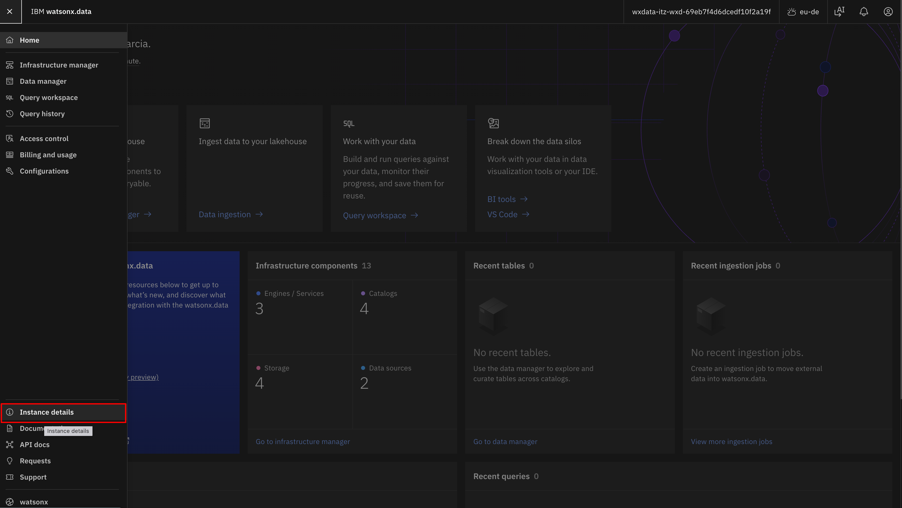
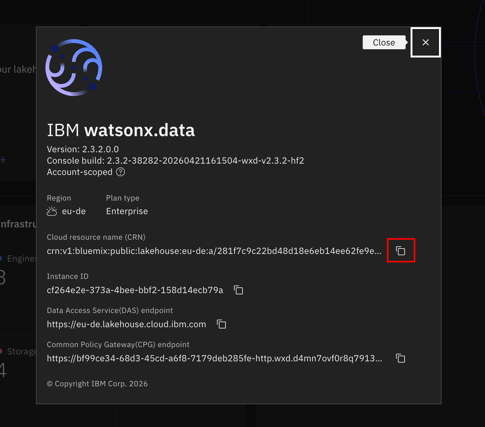

# watsonx.data CRN

Follow this guide to get the Cloud Resource Name **CRN** for your watsonx.data instance

## Step 1: Access Instance Details

1. Log in to the watsonx.data console
2. Click the hamburger menu (☰) on the top left
3. Select **Instance details**

   

## Step 2: Copy the CRN

1. Click the copy icon next to the CRN to copy it to your clipboard

   

## Step 3: Save the CRN

Copy the **CRN** value to the file you use to store your credentials as `WXDATA_CRN`

**Example:**

```txt
WXDATA_CRN=crn:v1:bluemix:public:lakehouse:us-south:a/1234567890abcdef:12345678-1234-1234-1234-123456789abc::
```

Return to [watsonx.data connection](wxdata_connection.md#2-watsonxdata-instance-crn) guide