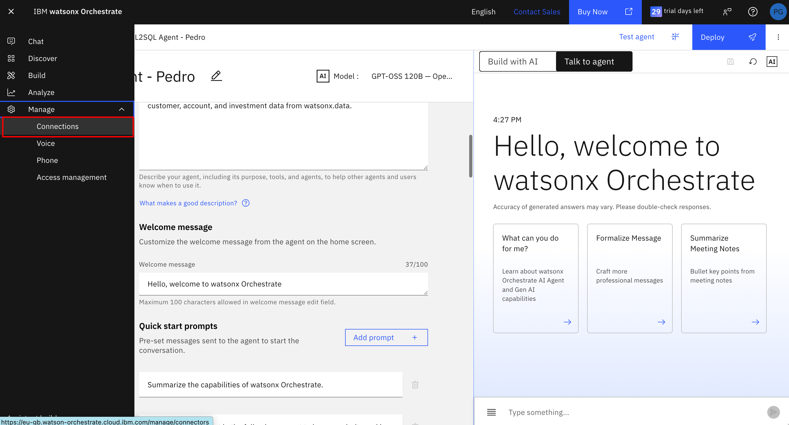
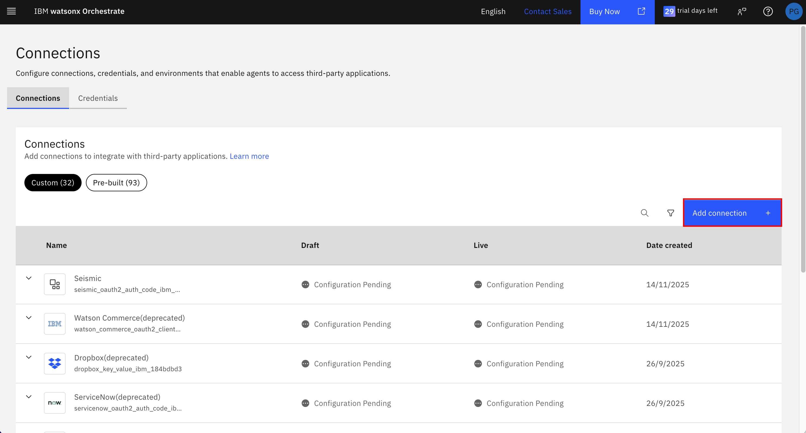
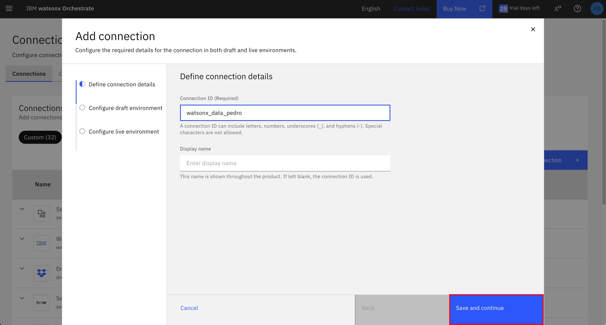
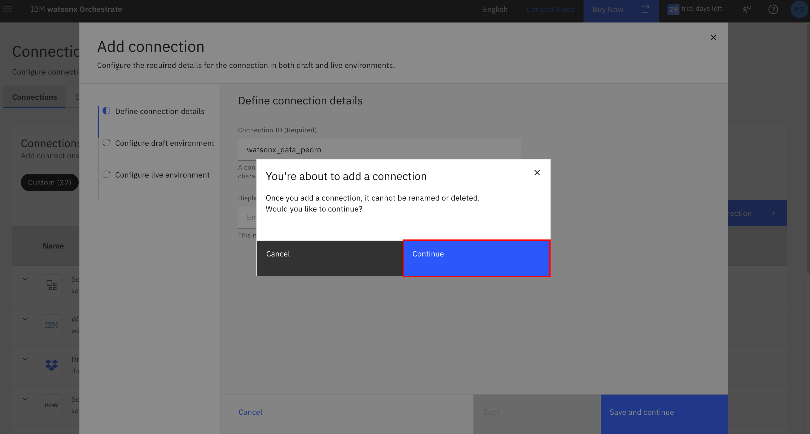
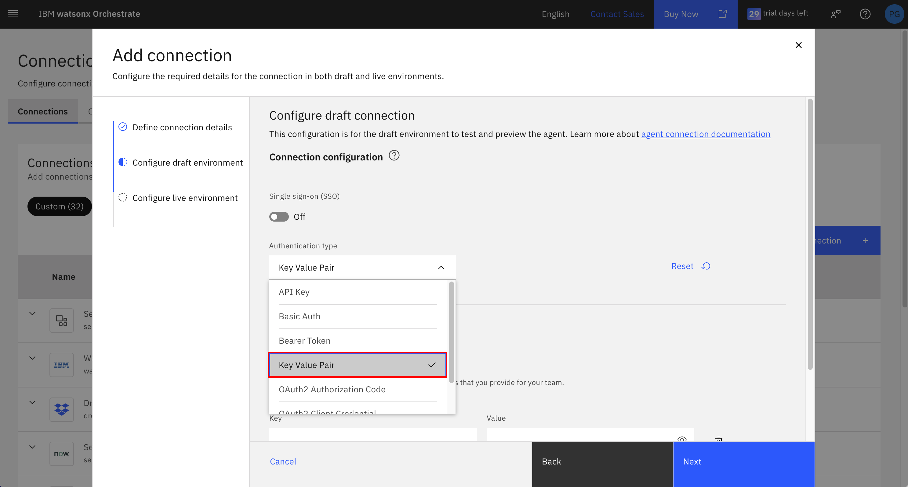
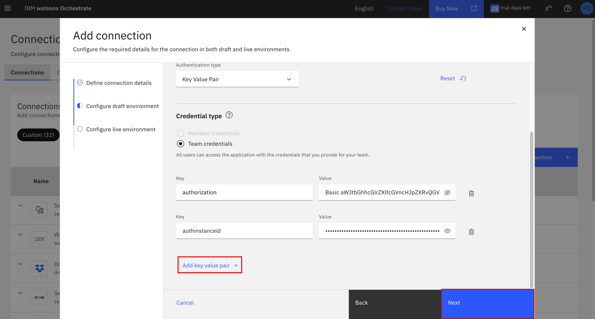

# 🔌 Configure watsonx.data Remote MCP Server Connection

This guide walks you through configuring the connection between your AI agent and watsonx.data tools using the Model Context Protocol (MCP) server.

## 📋 Table of Contents

- [🔌 Configure watsonx.data Remote MCP Server Connection](#-configure-watsonxdata-remote-mcp-server-connection)
  - [📋 Table of Contents](#-table-of-contents)
  - [Prerequisites](#prerequisites)
    - [1. ApiKey Authorization Token](#1-apikey-authorization-token)
      - [Step 1: Check Your Credentials](#step-1-check-your-credentials)
      - [Step 2: Generate Authorization Token](#step-2-generate-authorization-token)
      - [Step 3: Save the Token](#step-3-save-the-token)
    - [2. watsonx.data Instance CRN](#2-watsonxdata-instance-crn)
    - [3. Remote MCP Server Endpoint](#3-remote-mcp-server-endpoint)
      - [Step 1: Identify Your Region](#step-1-identify-your-region)
      - [Step 2: Construct Your Endpoint](#step-2-construct-your-endpoint)
      - [Step 3: Save the Endpoint](#step-3-save-the-endpoint)
  - [Configure Connection in watsonx Orchestrate](#configure-connection-in-watsonx-orchestrate)
    - [Step 1: Navigate to Connections](#step-1-navigate-to-connections)
    - [Step 2: Configure Connection Details](#step-2-configure-connection-details)
    - [Step 3: Configure Draft Environment](#step-3-configure-draft-environment)
    - [Step 4: Configure Live environment](#step-4-configure-live-environment)
  - [✅ Connection Complete](#-connection-complete)

## Prerequisites

Before configuring the connection, you need to gather three pieces of information. Complete each section below in order.

### 1. ApiKey Authorization Token

The API key cannot be used directly; you must generate a Base64-encoded authorization token.

#### Step 1: Check Your Credentials

Open your [env.txt](../../student_creds/env.txt) file and locate these values:

```txt
WXD_USER
WXD_API_KEY
```

#### Step 2: Generate Authorization Token

Open a terminal on your system and run the appropriate command for your operating system:

Mac or Linux:
```
echo -n "<WXD_USER>:<WXD_API_KEY>" | base64
```
Windows PowerShell:
```
[Convert]::ToBase64String([Text.Encoding]::ASCII.GetBytes("<WXD_USER>:<WXD_API_KEY>"))
```
> Important: Replace <WXD_USER> and <WXD_API_KEY> with your actual values from `env.txt`

For automation to generate this token, follow this guide [Generate ApiKey Auth Token](./automation/apikey_token/README.md)

#### Step 3: Save the Token

Copy the generated **ApiKey authorization token** to your [env.txt](../../student_creds/env.txt) file as `WXDATA_TOKEN`

**Example:**

```txt
WXDATA_TOKEN="************************************"
```

### 2. watsonx.data Instance CRN

The Cloud Resource Name (CRN) uniquely identifies your **watsonx.data** instance. You should find it in your [env.txt](../../student_creds/env.txt) file

**Example:**

```txt
WXDATA_CRN="crn:v1:bluemix:public:lakehouse:us-south:a/1234567890abcdef:12345678-1234-1234-1234-123456789abc::"
```

> **Optional**: For detail steps to manually find the watsonx.data CRN, follow [here](./crn_optional.md)


### 3. Remote MCP Server Endpoint

The MCP server endpoint allows your agent to communicate with watsonx.data. This will be used when you connect to the MCP server within the agent you will be creating.

**Endpoint Format:**

```txt
https://<console-host>/api/v1/watsonxdata/mcp
```

#### Step 1: Identify Your Region

Replace `<console-host>` with the appropriate value for your instance location:

| Region        | Location               | Console Host                               |
| ------------- | ---------------------- | ------------------------------------------ |
| Asia Pacific  | Sydney, Australia      | `console-ibm-ausyd.lakehouse.saas.ibm.com` |
| Asia Pacific  | Tokyo, Japan           | `jp-tok.lakehouse.cloud.ibm.com`           |
| Europe        | Frankfurt, Germany     | `eu-de.lakehouse.cloud.ibm.com`            |
| Europe        | London, United Kingdom | `eu-gb.lakehouse.cloud.ibm.com`            |
| North America | Toronto, Canada        | `console-ibm-cator.lakehouse.saas.ibm.com` |
| North America | Washington DC, USA     | `us-east.lakehouse.cloud.ibm.com`          |
| North America | Dallas, USA            | `us-south.lakehouse.cloud.ibm.com`         |

#### Step 2: Construct Your Endpoint

For example, if your instance is in Dallas:

```txt
https://us-south.lakehouse.cloud.ibm.com/api/v1/watsonxdata/mcp
```

#### Step 3: Save the Endpoint

Copy your complete **MCP server endpoint** to your `env.txt` file as `WXDATA_MCP_ENDPOINT`

## Configure Connection in watsonx Orchestrate

Now that you have all the required information, let's configure the connection in watsonx Orchestrate.

### Step 1: Navigate to Connections

1. In watsonx Orchestrate, click the hamburger menu (☰) on the top left
2. Click **Manage**
3. Click **Connections**

   

4. Click **Add Connection**

   

### Step 2: Configure Connection Details

1. Enter a **Connection ID**: `watsonx_data_YOUR_NAME`

   > Replace `YOUR_NAME` with your actual name (e.g., `watsonx_data_john_smith`)

2. Click **Save and continue**

   

3. Click **Continue**

   

### Step 3: Configure Draft Environment

1. **Select Authentication Type**
   - Choose **Key Value Pair** from the dropdown

   

2. **Add Credentials**

   Enter the first credential:
   - **Key:** `authorization`
   - **Value:** `Basic <WXDATA_TOKEN>`
     > Replace `<WXDATA_TOKEN>` with the token you generated earlier
     > **Important:** Include the word "Basic" followed by a space before your token. After pasting the token you may need to go back and add the space.

   Click **Add key value pair +**

   Enter the second credential:
   - **Key:** `authinstanceid`
   - **Value:** value of `WXDATA_CRN`

3. Click **Next**

   

### Step 4: Configure Live environment

Repeat the steps above for the "Live" environment, then select **Finish**

Wait for the confirmation message: **"Connection Creation successful"**


## ✅ Connection Complete

Your watsonx.data connection is now configured and ready to use with your AI agent!

**Next Steps:**

- Return to [NL2SQL Business User Guide](README.md) to continue building your agent
